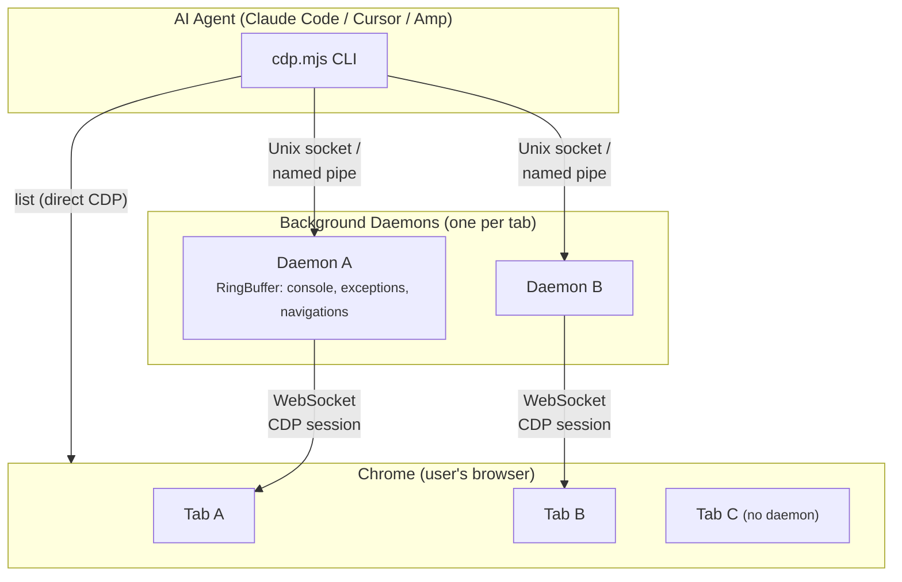

# chrome-cdp

[](skills/chrome-cdp/scripts/cdp.mjs)
[](skills/chrome-cdp/scripts/cdp.mjs)
[](https://nodejs.org)
[](LICENSE)

**Every browser automation tool launches a clean, isolated browser.**
**This one connects to yours.**

Your AI agent sees the tabs you already have open, your logged-in accounts, your cookies, your page state. No separate browser instance. No re-login. No lost context.

## What makes this different

Most browser tools give the agent a screenshot and say "figure it out." This tool gives the agent a **structured understanding of the page** — every interactive element indexed, every action tracked, every change reported.

| Capability | This tool | Screenshot-based tools | Basic CDP wrappers |
|---|---|---|---|
| **Page understanding** | Enriched accessibility tree with layout, style hints, scroll position | Screenshot → vision model (slow, lossy, expensive) | Raw accessibility dump (noisy, no layout) |
| **Element targeting** | `@ref` indices — `click @3`, `fill @7 "text"` | Coordinate guessing from screenshots | CSS selectors only |
| **Action feedback** | Automatic perceive diff after click/press/select | Take another screenshot and compare | Nothing — agent flies blind |
| **Form automation** | `fill`, `select`, `press`, `waitfor`, `upload`, `dialog` | Manual JS injection | Not included |
| **Background observation** | Console, exceptions, navigations buffered in ring buffers | Not available | Not available |
| **Input simulation** | CDP mouse events (mouseMoved → mousePressed → mouseReleased) | Injected `el.click()` | Injected `el.click()` |
| **WSL2 → Windows** | Built-in support (proven patterns) | Not supported | Not supported |
| **Dependencies** | 0 (pure Node.js built-ins) | Playwright/Puppeteer + browser binary | Varies |
| **Commands** | 42 | N/A (programmatic API) | ~14 |

### The `@ref` workflow in action

```
$ cdp perceive abc1
📍 My App (1280×720 scroll:0/2400) — https://app.example.com
  [nav] h:48 bg:rgb(24,24,27)
    @1 [link] "Home" (12,8 60×20)
    @2 [link] "Settings" (80,8 70×20)
  [main] ↓below fold
    @3 [textbox] "Email" (200,350 200×30)
    @4 [button] "Submit" (200,400 100×40)

$ cdp fill abc1 @3 "user@example.com"
  △ @3 [textbox] "Email" → value:"user@example.com"

$ cdp click abc1 @4
  △ [dialog] "Submitted successfully"
  △ @4 [button] "Submit" → disabled
```

No CSS selectors. No coordinate guessing. No second screenshot. The agent sees the page structure, interacts by reference, and gets instant feedback on what changed.

## Quick Start

```bash
git clone https://github.com/EndeavorYen/chrome-cdp-skill.git
```

Then load it in Claude Code:

```bash
claude --plugin-dir ./chrome-cdp-skill
```

Or install globally (available in all projects):

```bash
cp -r chrome-cdp-skill/skills/chrome-cdp ~/.claude/skills/
```

### Enable Chrome debugging

Navigate to `chrome://inspect/#remote-debugging` and toggle the switch. That's it — do **not** restart Chrome with `--remote-debugging-port`.

**Requires:** Node.js 22+ (uses built-in WebSocket). Auto-detects Chrome, Chromium, Brave, Edge, and Vivaldi on macOS, Linux (including Flatpak), and Windows.

<details>
<summary><strong>Advanced Configuration</strong></summary>

- `CDP_PORT_FILE` — override the DevToolsActivePort path
- `CDP_HOST` — override the Chrome host (default: `127.0.0.1`)

</details>

## How It Works



Each tab gets its own daemon process that holds the CDP session open — Chrome's "Allow debugging" dialog fires **once per tab**, not once per command. Daemons auto-exit after 20 minutes of inactivity and passively collect console/exception/navigation events into ring buffers.

## Commands (42 total)

<details>
<summary><strong>Discovery & Lifecycle</strong></summary>

```bash
list                               # list open tabs (shows targetId prefixes)
open   [url]                       # open new tab (default: about:blank)
stop   [target]                    # stop daemon(s)
closetab <target>                  # close a browser tab
```

</details>

<details>
<summary><strong>Perception</strong> — start here</summary>

```bash
perceive <target> [flags]          # enriched AX tree with @ref indices + coordinates
                                   #   --diff: show only changes since last perceive
                                   #   -s <sel>: scope to CSS selector subtree
                                   #   -i: interactive elements only
                                   #   -d N: limit tree depth
                                   #   -C: include non-ARIA clickable elements
snap     <target> [--full]         # accessibility tree (compact by default)
summary  <target>                  # token-efficient overview (~100 tokens)
status   <target>                  # URL, title + new console/exception entries
console  <target> [--all|--errors] # console buffer (default: unread only)
text     <target>                  # clean text content (strips scripts/styles/SVG)
table    <target> [selector]       # full table data extraction (tab-separated)
```

</details>

<details>
<summary><strong>Visual Capture</strong></summary>

```bash
shot     <target> [file|--annotate] # viewport screenshot; --annotate overlays @ref labels
elshot   <target> <sel|@ref>        # element screenshot (auto scroll + clip, no DPR issues)
scanshot <target>                   # segmented full-page (readable viewport-sized images)
fullshot <target> [file]            # single full-page image (may be tiny on long pages)
```

</details>

<details>
<summary><strong>Inspection</strong></summary>

```bash
html    <target> [selector]        # full HTML or scoped to CSS selector
eval    <target> <expr>            # evaluate JS in page context
styles  <target> <selector>        # computed styles (meaningful props only)
net     <target>                   # network performance entries
netlog  <target> [--clear]         # network request log (XHR/Fetch with status + timing)
cookies <target>                   # list cookies for current page
cookieset <target> <cookie>        # set a cookie ("name=value; domain=...")
cookiedel <target> <name>          # delete a cookie by name
```

</details>

<details>
<summary><strong>Interaction</strong></summary>

```bash
click   <target> <sel|@ref>        # click element (CDP mouse events, not el.click())
clickxy <target> <x> <y>           # click at CSS pixel coordinates
type    <target> <text>            # type at focused element (cross-origin safe)
press   <target> <key>             # press key (Enter, Tab, Escape, etc.)
scroll  <target> <dir|x,y> [px]   # scroll (down/up/left/right; default 500px)
hover   <target> <sel|@ref>        # hover (triggers :hover, tooltips)
fill    <target> <sel|@ref> <text> # clear field + type (form filling)
select  <target> <selector> <val>  # select dropdown option by value
waitfor <target> <selector> [ms]   # wait for element to appear (default 10s)
loadall <target> <selector> [ms]   # click "load more" until gone
upload  <target> <selector> <paths> # upload file(s) to <input type="file">
dialog  <target> [accept|dismiss]  # dialog history; set auto-accept or auto-dismiss
```

</details>

<details>
<summary><strong>Navigation & Viewport</strong></summary>

```bash
nav     <target> <url>             # navigate to URL and wait for load
back    <target>                   # navigate back in browser history
forward <target>                   # navigate forward
reload  <target>                   # reload current page
viewport <target> [WxH]           # show or set viewport size (e.g. 375x812)
```

</details>

<details>
<summary><strong>Advanced</strong></summary>

```bash
batch   <target> <json>            # execute multiple commands in one call
                                   # [{"cmd":"click","args":["@1"]},{"cmd":"perceive","args":["--diff"]}]
evalraw <target> <method> [json]   # raw CDP command passthrough
                                   # e.g. evalraw <t> "DOM.getDocument" '{}'
```

</details>

**Action feedback:** `click`, `clickxy`, `press` (Enter/Escape/Tab), and `select` automatically wait for DOM to settle and return a perceive diff showing what changed — no need to manually run `perceive --diff` after these actions.

`<target>` is a unique targetId prefix from `list`. See [SKILL.md](skills/chrome-cdp/SKILL.md) for detailed usage, workflow patterns, and coordinate system.

<details>
<summary><strong>WSL2 → Windows Browser Control</strong></summary>

This tool works across the WSL2 → Windows boundary — most CDP tools don't. The proven pattern:

1. Start Chrome **on Windows** and enable debugging at `chrome://inspect/#remote-debugging`
2. Agent uses **Windows-side Node.js** to run the CDP script (WSL cannot connect to Windows localhost directly)
3. Locate Node.js:
   ```bash
   powershell.exe -NoProfile -Command "(Get-Command node -ErrorAction SilentlyContinue).Source"
   ```
4. Convert to WSL mount path and invoke:
   ```bash
   "/mnt/c/.../node.exe" scripts/cdp.mjs list
   ```

See [SKILL.md](skills/chrome-cdp/SKILL.md) for full WSL2 setup instructions.

</details>

## Credits

- **Original**: [pasky/chrome-cdp-skill](https://github.com/pasky/chrome-cdp-skill) by Petr Baudis — daemon-per-tab architecture and core CDP client
- **Contributors**: [ynezz](https://github.com/ynezz) (Flatpak paths), [Jah-yee](https://github.com/Jah-yee), [Rolf Fredheim](https://github.com/rolfredheim)
- **This fork**: `@ref` system, perceive-first workflow, action feedback, background observation, realistic input simulation, form automation, WSL2 support, and 28 additional commands

## License

[MIT](LICENSE)
