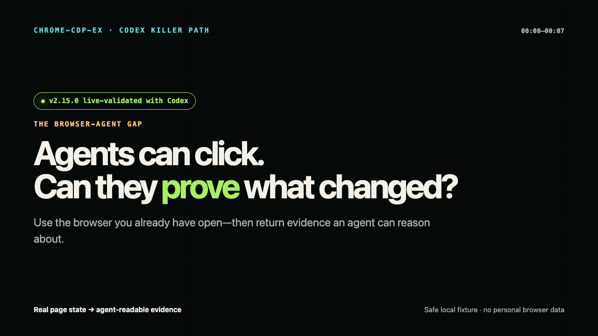

# chrome-cdp-ex

> **Unreleased candidate:** repository metadata is v2.16.0; install links and measured release evidence remain pinned to published v2.15.0.

[](skills/chrome-cdp-ex/scripts/cdp.mjs)
[](skills/chrome-cdp-ex/scripts/cdp.mjs)
[](https://nodejs.org)
[](https://github.com/EndeavorYen/chrome-cdp-ex/releases/tag/v2.15.0)
[](LICENSE)

> **Use the browser you already have open.** Give coding agents eyes and hands on your Chrome, Edge, or Electron session — including its current tabs, login state, and live page state — with evidence for every action.

**Agent hosts:** [Codex](docs/integrations/codex.md) · [Claude Code](docs/integrations/claude.md) · [Cursor](docs/integrations/cursor.md) · [OpenClaw](docs/integrations/openclaw.md) · [Hermes](docs/integrations/hermes.md) · [Pi](docs/integrations/pi.md)

<p align="center">
  <a href="experiment/codex-killer-path-demo.mp4"></a>
</p>

**[Watch the 60-second Codex demo →](experiment/codex-killer-path-demo.mp4)** · **[Try the Codex Killer Path →](docs/examples/codex-killer-path.md)** · [See all integrations →](INTEGRATIONS.md)

Playwright is excellent for deterministic tests in a clean browser. `chrome-cdp-ex` is for **live-page perception** when the agent needs the browser you are actually using, plus Action Receipts, recovery guidance, and a session handoff.

> **Evidence boundary:** Phase 1 candidate evidence live-validated the Codex CLI-skill route on one disposable local fixture, but that full installation loop is historical for the current tree. The current Runtime v3 benchmark below passed on the exact candidate; it does not replace a full Codex host-installation rerun. Claude Code, Cursor, OpenClaw, Hermes, and Pi have documented install routes; this does not claim that every route was live-tested. Benchmark "real-app" profiles are local fixtures, not external production apps.

## Proof, with boundaries

| Evidence | What it proves |
|---|---|
| [Codex demo and reproducible route](docs/examples/codex-killer-path.md) | One disposable-fixture loop completed `doctor → open → perceive → act → evidence → report`; the [host manifest](docs/benchmarks/host-validation.v1.json) records the boundary |
| [Smart Eye benchmark](https://endeavoryen.github.io/chrome-cdp-ex/experiment/benchmark.html) | Latest measured release: the v2.15.0 mixed local campaign passed 10/10 rounds, including five local fixture profiles — not external production apps |
| [Redesign experiment](https://endeavoryen.github.io/chrome-cdp-ex/experiment/showcase.html) | On the controlled comparison page, richer perception produced the stronger redesign |
| [Curated ecosystem listing](https://github.com/hesreallyhim/awesome-claude-code#providers-runtime--integration-infrastructure) | `awesome-claude-code` independently lists the project for its live-session perception and benchmark rigor; recognition is not adoption |

[v2.15.0 release notes →](https://github.com/EndeavorYen/chrome-cdp-ex/releases/tag/v2.15.0)

## Why agents need this

| Pain | What this gives the agent |
|---|---|
| "I can click, but I cannot really see the page." | Layout, visible text, colors, coordinates, refs, console health |
| "I clicked. Did anything happen?" | Action Receipt: dispatch, settlement, delta, blockers, next steps |
| "Which CSS rule made this button blue?" | `cascade` traces style back to selector and source line |
| "The bug only happens in my logged-in browser." | Real Chrome / Edge / Brave / Electron / WSL2→Windows sessions |
| "Exploration disappears after one prompt." | Reports, checkpoints, replay, Playwright export |

## Use this when

- The user is already logged in and you do not want to recreate state.
- The agent needs layout, visible styles, and interactive targets cheaply.
- Each click / fill should explain what changed.
- You need a trail: screenshots, logs, reports, checkpoints, replay, or a Playwright draft.

## Do not use this when

| Use Playwright for | Use `chrome-cdp-ex` for |
|---|---|
| CI suites in isolated browsers | Live user sessions and authenticated tabs |
| Deterministic locators and assertions | Agent perception, diagnosis, and recovery |
| Cross-browser test matrices | Chrome / CDP / Electron inspection |
| Fresh state per test | Long-session debugging and handoff reports |

## Five success cases

| Case | What the agent does |
|---|---|
| Logged-in dashboard inspection | `doctor → list → perceive` on the real dashboard |
| Action evidence after form input | `fill` / `click` return an Action Receipt (`changed`, `no-change`, `failed`, …) |
| CSS source tracing | `cascade @ref background-color` → winning selector and source line |
| Long-session debugging | `status`, `netlog`, `mock` / `clock` / `throttle`, `report` |
| Workflow capture and replay | `checkpoint`, `record-actions`, `export-playwright`, `replay` |

## Quick start

Shortest first run: [Killer Path](docs/examples/killer-path.md). Host matrix: [INTEGRATIONS.md](INTEGRATIONS.md).

### 1. Install

**Pinned release (v2.15.0):**

```bash
curl -L -o pi-chrome-cdp-2.15.0.tgz https://github.com/EndeavorYen/chrome-cdp-ex/releases/download/v2.15.0/pi-chrome-cdp-2.15.0.tgz
mkdir -p chrome-cdp-ex-v2.15.0
tar -xzf pi-chrome-cdp-2.15.0.tgz -C chrome-cdp-ex-v2.15.0 --strip-components=1
cd chrome-cdp-ex-v2.15.0
```

Checksum is published on the [GitHub Release](https://github.com/EndeavorYen/chrome-cdp-ex/releases/tag/v2.15.0). This project does **not** publish to the npm registry.

**Current `main`:**

```bash
git clone https://github.com/EndeavorYen/chrome-cdp-ex.git
cd chrome-cdp-ex
```

### 2. Wire your agent host

```bash
node scripts/setup.mjs --detect
node scripts/setup.mjs --for cursor --write   # Cursor → .cursor/mcp.json
# Claude:  claude --plugin-dir .
# Codex:   mkdir -p ~/.codex/skills && cp -r skills/chrome-cdp-ex ~/.codex/skills/
# Others:  node scripts/setup.mjs --for openclaw|hermes|pi|claude
```

### 3. Ready the browser

```bash
node scripts/setup.mjs --verify
./bin/chrome-cdp doctor
# or: "$HERMES_HOME/node/bin/node" skills/chrome-cdp-ex/scripts/cdp.mjs doctor
```

If `node -v` is <22, use the Node 22 path printed by doctor (`./bin/chrome-cdp` re-execs it when found).

If CDP is not reachable:

1. Prefer enabling remote debugging at `chrome://inspect/#remote-debugging` (or `edge://inspect`).
2. Or, with consent, spawn an isolated profile:  
   `./bin/chrome-cdp spawn-debug-browser edge --port 9222 --url https://example.com`  
   (add `--headless --no-sandbox` in CI / headless environments).
3. For Electron, start with `--remote-debugging-port=<port>` and set `CDP_PORT=<port>`.

### 4. Golden path

```bash
./bin/chrome-cdp doctor
./bin/chrome-cdp list
./bin/chrome-cdp open https://example.com          # if list is empty
./bin/chrome-cdp use <target> --name app           # optional alias
./bin/chrome-cdp perceive app -C -d 8
./bin/chrome-cdp click app @ref                    # or: fill app <selector> <text>
./bin/chrome-cdp verify-click app @ref --expect-text "Saved"
./bin/chrome-cdp perceive app --since-action
./bin/chrome-cdp report app                        # --format json for handoffs
```

Loop: **perceive → act → ask what changed**. Action JSON uses `receipt.schema = chrome-cdp-ex.action-receipt.v1`.

**Requires:** Node.js 22 (built-in WebSocket). Prefer `./bin/chrome-cdp` or `$HERMES_HOME/node/bin/node` when PATH `node` is older. Auto-detects Chrome, Chromium, Brave, Edge, and Vivaldi on macOS, Linux (including Flatpak), and Windows.

## How it works

One lightweight daemon per tab keeps CDP session context, console / network / navigation buffers, and structured next steps.

```text
doctor → list/open → perceive → click/fill → perceive --since-action → report
```

| Need | Start with |
|---|---|
| Understand the page | `perceive`, `controls`, `summary` |
| Act and verify | `click`, `fill`, `press`, `verify-click`, Action Receipt, `perceive --since-action` |
| UI smoke | `qa` |
| Reuse targets | `use`, `current`, `forget` |
| Debug live state | `status`, `console`, `netlog`, `report` |
| Trace styling | `cascade`, `styles`, `inject` |
| Preserve a session | `checkpoint`, `record-actions`, `export-playwright`, `replay` |
| Capture visuals | `shot`, `elshot`, `diff-shot` |
| Agent-native API | stdio MCP via `mcp-server.mjs` |

Full map: [docs/reference.md](docs/reference.md) · always-loaded skill: [SKILL.md](skills/chrome-cdp-ex/SKILL.md) · deep flags: [references/commands.md](skills/chrome-cdp-ex/references/commands.md).

### Generated command catalog

<!-- chrome-cdp-ex:generated-command-surface:start -->
_Generated from the immutable command catalog; edit command metadata at its source, not this region._

| Command | Synopsis | Catalog policy |
|---|---|---|
| `help` | `help` | `read / standard` |
| `list` | `list\|tabs\|ls [--format json]` | `read / standard` |
| `target` | `target --url URL\|--title TEXT [--exact] [--format json]` | `read / standard` |
| `tab-group` | `tab-group list\|create\|add\|remove\|delete\|show [--format json]` | `conditional-mutation / conditional` |
| `broadcast` | `broadcast <group> <cmd> [args...] [--format json] [--full-results]` | `mutation / mutation` |
| `use` | `use <target> --name <alias>` | `protected-mutation / mutation` |
| `attach` | `attach --port N --target <id> --name <alias>` | `protected-mutation / mutation` |
| `current` | `current [--format json]` | `read / standard` |
| `forget` | `forget <alias>` | `protected-mutation / mutation` |
| `perceive` | `perceive <target> [flags] [--format json]` | `read / standard` |
| `snap` | `snap <target> [--full]` | `read / standard` |
| `controls` | `controls <target> [-s selector] [--filter text] [--limit N] [--compact] [--format json]` | `read / standard` |
| `eval` | `eval <target> <expr>` | `script / raw-script` |
| `eval64` | `eval64 <target> <base64>` | `script / raw-script` |
| `call` | `call <target> <expr\|fn>` | `script / raw-script` |
| `elshot` | `elshot <target> <sel\|@ref>` | `read / standard` |
| `shot` | `shot <target> [file\|--annotate]` | `conditional-mutation / conditional` |
| `diff-shot` | `diff-shot <target> [--reset] [--threshold pct]` | `conditional-mutation / conditional` |
| `html` | `html <target> [selector]` | `read / standard` |
| `nav` | `nav <target> <url> [--format json]` | `mutation / mutation` |
| `mock` | `mock <target> [add\|clear]` | `mutation / mutation` |
| `clock` | `clock <target> [freeze\|offset\|reset]` | `mutation / mutation` |
| `throttle` | `throttle <target> [off\|offline\|slow-3g\|fast-3g\|lte\|custom]` | `mutation / mutation` |
| `status` | `status <target> [--runtime]` | `read / standard` |
| `console` | `console <target> [--all\|--errors\|--clear]` | `conditional-mutation / conditional` |
| `summary` | `summary <target>` | `read / standard` |
| `report` | `report <target> [--last N\|--all] [--format json] [--qa\|--summary] [--compact]` | `evidence / standard` |
| `checkpoint` | `checkpoint <target> [--unsafe-full] [--format json]` | `sensitive-read / sensitive-read` |
| `restore` | `restore <target> --file <path> [--format json]` | `mutation / mutation` |
| `record-actions` | `record-actions <target>` | `read / standard` |
| `export-playwright` | `export-playwright <target> [--format json]` | `read / standard` |
| `replay` | `replay <target> --file <path> [--format json]` | `mutation / mutation` |
| `frame` | `frame <target> [--format json]` | `read / standard` |
| `overlay` | `overlay <target> [sel\|@ref] [--format json]` | `read / standard` |
| `qa` | `qa <target> [--desktop WxH] [--mobile WxH] [--format json]` | `mutation / mutation` |
| `responsive-audit` | `responsive-audit <target> [--viewport WxH ...] [--out-dir DIR] [--format json]` | `mutation / mutation` |
| `verify-click` | `verify-click <target> <sel\|@ref> [--format json]` | `mutation / mutation` |
| `net` | `net <target>` | `read / standard` |
| `click` | `click <target> <sel\|@ref> [--format json] [--qa\|--summary]` | `mutation / mutation` |
| `jsclick` | `jsclick <target> <sel\|@ref>` | `mutation / mutation` |
| `clickxy` | `clickxy <target> <x> <y> [--format json]` | `mutation / mutation` |
| `type` | `type <target> <text> [--format json]` | `mutation / mutation` |
| `press` | `press\|key <target> <key> [--format json]` | `mutation / mutation` |
| `scroll` | `scroll <target> <dir\|x,y> [px] [--format json]` | `mutation / mutation` |
| `hover` | `hover <target> <sel\|@ref>` | `protected-mutation / mutation` |
| `waitfor` | `waitfor <target> <selector> [ms]` | `read / standard` |
| `loadall` | `loadall <target> <selector> [ms]` | `protected-mutation / mutation` |
| `wait` | `wait <target> <ms>` | `read / standard` |
| `fill` | `fill <target> <sel\|@ref> <txt> [--format json]` | `mutation / mutation` |
| `select` | `select <target> <selector> <val> [--format json]` | `mutation / mutation` |
| `fullshot` | `fullshot <target> [file]` | `conditional-mutation / conditional` |
| `scanshot` | `scanshot <target>` | `read / standard` |
| `styles` | `styles <target> <selector> [--root auto\|body\|document\|<sel>]` | `read / standard` |
| `components` | `components <target> [--depth N] [@ref\|selector] [--max-chars N] [--unsafe-full] [--format json]` | `sensitive-read / sensitive-read` |
| `cookies` | `cookies <target>` | `sensitive-read / sensitive-read` |
| `cookieset` | `cookieset <target> <cookie>` | `mutation / mutation` |
| `cookiedel` | `cookiedel <target> <name>` | `mutation / mutation` |
| `dialog` | `dialog <target> [accept\|dismiss]` | `protected-mutation / mutation` |
| `viewport` | `viewport\|resize <target> [WxH]` | `mutation / mutation` |
| `emulate` | `emulate <target> [dark\|light\|no-preference\|off\|status]` | `mutation / mutation` |
| `upload` | `upload <target> <selector> <paths> [--format json]` | `mutation / mutation` |
| `text` | `text <target> [selector]` | `read / standard` |
| `table` | `table <target> [TABLE_SELECTOR] [--format text\|json] \| table <target> [TABLE_SELECTOR] --collect --scroll-container SELECTOR [--load-more SELECTOR] [--row-key-column N] [--format text\|json] \| table <target> --continue TOKEN --format json` | `conditional-mutation / conditional` |
| `back` | `back <target>` | `mutation / mutation` |
| `forward` | `forward <target>` | `mutation / mutation` |
| `reload` | `reload <target>` | `mutation / mutation` |
| `closetab` | `closetab <target>` | `mutation / mutation` |
| `netlog` | `netlog <target> [--clear]` | `conditional-mutation / conditional` |
| `inject` | `inject <target> <flag> [content]` | `mutation / mutation` |
| `cascade` | `cascade <target> <sel\|@ref> [prop] [--format json]` | `read / standard` |
| `record` | `record <target> [ms]` | `conditional-mutation / conditional` |
| `evalraw` | `evalraw <target> <method> [json]` | `raw-cdp / raw-cdp` |
| `batch` | `batch <target> <cmds> [--parallel] [--format json]` | `composite / composite` |
| `flow` | `flow <target> "<steps>" [--format json]` | `composite / composite` |
| `repeat` | `repeat <target> <N> <cmd> [args]` | `composite / composite` |
| `doctor` | `doctor / ready [--format json]` | `read / standard` |
| `keepalive` | `keepalive <target> <ms>` | `protected-mutation / mutation` |
| `open` | `open [url] [--perceive] [--attach-timeout-ms N] [--ready-timeout-ms N] [--ready-selector sel] [--reuse-url] [--format json]` | `mutation / mutation` |
| `spawn-debug-browser` | `spawn-debug-browser [browser] [--port N] [--url URL] [--profile-dir DIR] [--exe PATH] [--format json]` | `mutation / mutation` |
| `dismiss-modal` | `dismiss-modal <target>` | `mutation / mutation` |
| `stop` | `stop [target] [--format json]` | `mutation / mutation` |
<!-- chrome-cdp-ex:generated-command-surface:end -->

## Docs

- [INTEGRATIONS.md](INTEGRATIONS.md) — Claude Code, Codex, Cursor, OpenClaw, Hermes, Pi
- [Codex Killer Path](docs/examples/codex-killer-path.md) — host route, safe-fixture boundary, and required evidence
- [Killer Path](docs/examples/killer-path.md) — fastest dogfood route
- [Technical reference](docs/reference.md) — commands, MCP, Electron, WSL2, gates
- [Product strategy](docs/strategy/agent-browser-vision.md) — why this is not another Playwright
- [Self-improvement loop](docs/self-improvement-loop.md) — issue → test → PR → merge
- [v2.15.0 release](https://github.com/EndeavorYen/chrome-cdp-ex/releases/tag/v2.15.0) — notes, checksum, tarball

## Dogfood benchmark

Use the live benchmark before publishing performance or adoption claims. Visual proof: [benchmark.html](https://endeavoryen.github.io/chrome-cdp-ex/experiment/benchmark.html).

### Latest dogfood snapshot

Latest measured release: local run on 2026-08-12 for v2.15.0 against 5 safe local real-app fixtures: dashboard, docs-app, auth-flow, data-table, canvas-heavy. These are not external production apps. Timing starts after CDP is reachable. Publish competitor deltas only from measured baselines.

| Metric | Latest measured run |
|---|---:|
| Total time | 10.686s avg |
| Command calls | 24 per round |
| First useful observation | 2.213s avg |
| First action evidence | 2.941s avg |
| Golden path complete | 5.538s avg |
| Estimated output tokens | 11,429 avg |
| Useful observation tokens | 1,732 avg |
| Action evidence coverage | 6 auto-evidence actions per round; no failed criteria |
| Real-app targets | dashboard, docs-app, auth-flow, data-table, canvas-heavy |
| Stale-ref recovery | covered by all real-app adversarial profiles |
| Quality gate | 34/34 pass in all 5 real-app rounds |

Regenerate this table after meaningful command, perception, or benchmark changes:

```bash
npm run benchmark:campaign -- --rounds 10 --types mcp,cli,killer,large-app,real-app,real-app,real-app,real-app,real-app,cli --real-app-targets dashboard,docs-app,auth-flow,data-table,canvas-heavy --settle-ms 0 --json --output release-campaign.json
npm run benchmark:update-readme -- release-campaign.json README.md --html experiment/benchmark.html --date YYYY-MM-DD --version X.Y.Z
```

Schema fixture: [`docs/benchmarks/measured-baselines.example.json`](docs/benchmarks/measured-baselines.example.json) (format only — regenerate local measured baselines before publishing comparison deltas).

### Promotion checklist

Do not publish README, marketplace, awesome-list, or social comparison claims unless:

- `npm run benchmark:killer -- --json` exits 0 and `gate.passed` is true.
- A 10+ round mixed campaign covers matched MCP/CLI, Killer Path, large-app stress, and all five local real-app profiles before release or high-difficulty claims.
- The campaign candidate identity matches the release version and current runtime/benchmark source digest; truncated, relabeled, or stale artifacts must fail closed.
- Total output, per-command output, first-action-evidence, and per-command latency gates pass; inspect the gate `culprit` before publishing speed or efficiency claims.
- Action JSON passes the Action Receipt contract gate: `eventId`, `dispatch`, `settlement.state/strategy/signals`, `observedDeltaDetails`, `blockingSignals`, `recoveryHint`, and executable `nextSteps`.
- Competitor comparisons use `npm run benchmark:killer -- --comparison-baselines ./baselines.json` with measured baselines, not the planning-only `heuristic-smoke-baseline`.
- `docs/examples/killer-path.md` still covers real browser perception, failed action recovery, CSS tracing, and export handoff.
- Workflow handoffs from `record-actions --format json` and `export-playwright --format json` distinguish exported, skipped, review-needed, and live-only steps.
- If any benchmark gate criterion fails, **block promotion** and fix the failed criterion before publishing the claim.

Methodology: [docs/reference.md#benchmark-gate](docs/reference.md#benchmark-gate).

## Contributor checks

```bash
npm test
npm run lint
npm run check:docs
npm run smoke:live
```

## Credits

- **Original**: [pasky/chrome-cdp-skill](https://github.com/pasky/chrome-cdp-skill) by Petr Baudis (daemon-per-tab architecture and core CDP client)
- **Contributors**: [ynezz](https://github.com/ynezz) (Flatpak paths), [Jah-yee](https://github.com/Jah-yee), [Rolf Fredheim](https://github.com/rolfredheim), [hussainweb](https://github.com/hussainweb)
- **This fork**: `@ref` system, perceive-first workflow, Action Receipts, MCP adapter, cross-host setup, recovery paths, and an 81-command live-session surface

## License

[MIT](LICENSE)
