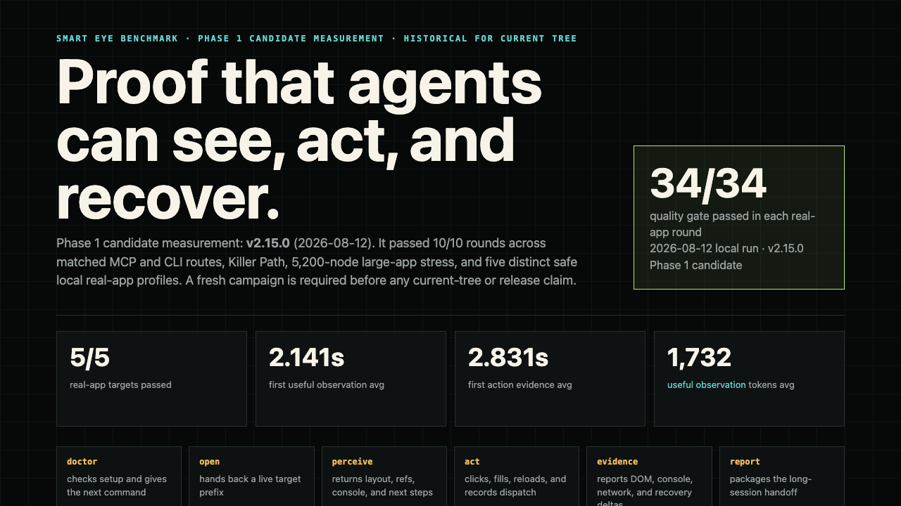

# chrome-cdp-ex

[](skills/chrome-cdp-ex/scripts/cdp.mjs)
[](skills/chrome-cdp-ex/scripts/cdp.mjs)
[](https://nodejs.org)
[](LICENSE)

> **TL;DR** — The Smart Eye for coding agents. `chrome-cdp-ex` lets an agent see and act inside your real browser: logged-in tabs, page layout, visible styles, action receipts, CSS source tracing, and long-session reports.

Playwright is excellent for deterministic tests in a clean browser. `chrome-cdp-ex` is for live-page perception when the agent needs to understand the browser you are actually using.

[](https://endeavoryen.github.io/chrome-cdp-ex/experiment/benchmark.html)

## Why agents need this

Browser agents usually fail for boring reasons: they cannot tell what changed, they lose context after a click, or they can inspect DOM but not the page humans see. This tool gives them the missing perception layer.

| Pain | What `chrome-cdp-ex` gives the agent |
|---|---|
| "I can click, but I cannot really see the page." | Layout, visible text, colors, coordinates, refs, and console health. |
| "I clicked. Did anything happen?" | Every action returns an Action Receipt with dispatch, settlement, observed delta, blocking signals, and next steps. |
| "Which CSS rule made this button blue?" | `cascade` traces the visible style back to selector and source line. |
| "The bug only happens in my logged-in browser." | It connects to real Chrome, Edge, Brave, Electron, or WSL2-to-Windows sessions. |
| "Exploration disappears after one prompt." | Session logs, screenshots, reports, checkpoints, replay, and Playwright export. |

## See it work

[](https://endeavoryen.github.io/chrome-cdp-ex/experiment/showcase.html)

| Proof | Why it matters |
|---|---|
| [Smart Eye benchmark](https://endeavoryen.github.io/chrome-cdp-ex/experiment/benchmark.html) | The current dogfood run passes a 29/29 quality gate with 1,569 useful observation tokens. |
| [Redesign experiment](https://endeavoryen.github.io/chrome-cdp-ex/experiment/showcase.html) | Same page, same prompt, same rounds; the agent with richer perception produced the best result. |
| [Killer Path walkthrough](docs/examples/killer-path.md) | A 60-second route through `doctor -> open -> perceive -> act -> evidence -> report`. |

## Use this when

Use `chrome-cdp-ex` when the page already matters and the agent needs useful context before acting.

- The user is already logged in and you do not want to recreate state.
- The agent needs to understand layout, visible styles, and interactive targets cheaply.
- You want each click, fill, reload, or upload to explain what changed.
- You need a trail: screenshots, logs, reports, checkpoints, replay, or a Playwright draft.

## Do not use this when

Use Playwright when you need a clean, repeatable browser test from scratch.

| Use Playwright for | Use `chrome-cdp-ex` for |
|---|---|
| CI suites in isolated browsers | Live user sessions and authenticated tabs |
| Deterministic locators and assertions | Agent perception, diagnosis, and recovery |
| Cross-browser test matrices | Chrome/CDP/Electron inspection |
| Fresh state per test | Long-session debugging and handoff reports |

## Five success cases

| Case | What the agent does |
|---|---|
| Logged-in dashboard inspection | `doctor -> list -> perceive` reads the real dashboard without relogin or a copied screenshot. |
| Action evidence after form input | `fill` or `click` returns an Action Receipt so the agent can distinguish dispatched, changed, no-change, failed, and timeout states. |
| CSS source tracing | `cascade @ref background-color` shows the winning selector and source file/line to edit. |
| Long-session debugging | `status`, `netlog`, `mock`, `clock`, `throttle`, screenshots, and `report` preserve evidence across a live tab session. |
| Workflow capture and replay | `checkpoint`, `record-actions`, `export-playwright`, `diff-shot`, and `replay` turn exploration into reusable debugging and regression assets. |

## Smart Eye Proof

The benchmark measures the agent path this tool is built for: see the page, act, verify, recover, and hand off evidence.

| Proof point | Latest local run |
|---|---:|
| Quality gate | **29/29 pass** |
| Golden path complete | **5.330s** |
| Useful observation tokens | **1,569** |
| Action evidence coverage | **100%** |
| Differentiator success rate | **100%** |

[**View the benchmark proof ->**](https://endeavoryen.github.io/chrome-cdp-ex/experiment/benchmark.html)

This is not a synthetic unit test. It launches a disposable debug browser, exercises perception, action evidence, recovery, CSS tracing, frame/modal/HMR probes, and report handoff, then blocks promotion claims if the gate fails. Re-run it with:

```bash
npm run benchmark:killer
```

## Quick start

For the shortest first run, use [the Killer Path walkthrough](docs/examples/killer-path.md).

1. Clone and enter the repo.

```bash
git clone https://github.com/EndeavorYen/chrome-cdp-ex.git
cd chrome-cdp-ex
```

2. Install in Claude Code (choose one option).

```bash
# Option A: load in Claude Code for the current project/session
claude --plugin-dir .

# Option B: install globally for all projects
mkdir -p ~/.claude/skills
cp -r skills/chrome-cdp-ex ~/.claude/skills/
```

3. Run the onboarding check.

```bash
node skills/chrome-cdp-ex/scripts/cdp.mjs doctor
```

`doctor` tells you whether the browser is reachable, what to run next, and how to recover common setup issues. If CDP is not ready, use one of these paths:

- **Existing browser session (preferred):** open `chrome://inspect/#remote-debugging` (or `edge://inspect`) and toggle remote debugging on. Cleanest path; touches no profile state.
- **Isolated debug profile:** `node skills/chrome-cdp-ex/scripts/cdp.mjs spawn-debug-browser edge --port 9222 --url https://example.com`. Add `--headless --no-sandbox` for Linux CI, containers, or remote shells without a display.
- **Electron app:** start it with `--remote-debugging-port=<port>` and run with `CDP_PORT=<port>`.

4. Follow the golden path.

```bash
node skills/chrome-cdp-ex/scripts/cdp.mjs doctor
node skills/chrome-cdp-ex/scripts/cdp.mjs list
node skills/chrome-cdp-ex/scripts/cdp.mjs open https://example.com   # only if list is empty; add --format json for scripts
node skills/chrome-cdp-ex/scripts/cdp.mjs use <target> --name app     # optional: reuse the tab as "app" or "current"
node skills/chrome-cdp-ex/scripts/cdp.mjs perceive <target> -C -d 8
node skills/chrome-cdp-ex/scripts/cdp.mjs click <target> @ref        # or fill <target> <selector> <text>
node skills/chrome-cdp-ex/scripts/cdp.mjs verify-click <target> @ref --expect-text "Saved"
node skills/chrome-cdp-ex/scripts/cdp.mjs perceive <target> --since-action
node skills/chrome-cdp-ex/scripts/cdp.mjs report <target>            # add --format json for agent handoff; --last N / --all controls timeline size
```

The important bit is the loop: first perceive the page, then act, then ask what changed because of that action. Use `--format json` when another agent or script needs structured handoff data; action JSON includes `receipt.schema = chrome-cdp-ex.action-receipt.v1`.

**Requires:** Node.js 22+ (uses built-in WebSocket). Auto-detects Chrome, Chromium, Brave, Edge, and Vivaldi on macOS, Linux (including Flatpak), and Windows.

## Deeper docs

- [Killer Path walkthrough](docs/examples/killer-path.md) — fastest way to dogfood the tool.
- [Product strategy](docs/strategy/agent-browser-vision.md) — why this is an agent perception layer, not another Playwright.
- [Technical reference](docs/reference.md) — command map, action evidence, semantic assertions, MCP server, Electron, WSL2, and benchmark gates.
- [Full skill reference](skills/chrome-cdp-ex/SKILL.md) — every command, flag, and troubleshooting path.
- [Benchmark proof](#dogfood-benchmark) — how promotion claims are gated.

## How it works

`chrome-cdp-ex` connects to Chrome DevTools Protocol and keeps one lightweight daemon per tab. The daemon preserves session context, collects console/network/navigation evidence, and lets commands return useful next steps instead of a bare success string.

Most readers only need this loop:

```bash
doctor -> list -> open -> perceive -> click/fill -> perceive --since-action -> report
```

See [docs/reference.md](docs/reference.md) for Electron, WSL2, screenshots, CSS tracing, network mocks, checkpoints, replay, export, MCP stdio use, and all 75 commands.

## Command map

| Need | Start with |
|---|---|
| Understand the page | `perceive`, `controls`, `summary`, `text` |
| Act and verify | `click`, `fill`, `press`, `verify-click`, Action Receipt JSON, `perceive --since-action` |
| Run a UI smoke | `qa` for desktop/mobile screenshots, perception, console health, and optional semantic checks |
| Reuse live targets | `use`, `attach`, `current`, `forget` for named target aliases such as `app` |
| Debug live state | `status`, `console`, `netlog`, `report` |
| Trace styling | `cascade`, `styles`, `inject` |
| Preserve a session | `checkpoint`, `record-actions`, `export-playwright`, `replay` |
| Capture visuals | `shot`, `elshot`, `diff-shot` |
| Agent-native integration | `node skills/chrome-cdp-ex/scripts/mcp-server.mjs` exposes stdio MCP tools for doctor/list/open/perceive/action/qa/report |

Full command details are in [docs/reference.md](docs/reference.md) and [skills/chrome-cdp-ex/SKILL.md](skills/chrome-cdp-ex/SKILL.md).

## Dogfood benchmark

Use the live benchmark before making performance or adoption claims. [View the visual benchmark proof](https://endeavoryen.github.io/chrome-cdp-ex/experiment/benchmark.html), then regenerate the raw numbers when command behavior changes.

### Latest dogfood snapshot

Local run on 2026-07-06 against the same smoke page. Timing starts after CDP is reachable so browser cold-start variance is excluded. Publish competitor comparison deltas only after rerunning with measured `--comparison-baselines`.

| Metric | Latest run |
|---|---:|
| Total time | 9.293s |
| Command calls | 24 |
| First useful observation | 2.184s |
| First action evidence | 3.013s |
| Golden path complete | 5.330s |
| Estimated output tokens | 19,177 |
| Useful observation tokens | 1,569 |
| Action evidence coverage | 100% (9/9 mutating commands) |
| Differentiator success rate | 100% |
| Stale-ref recovery | 67ms, 1/1 recovered |
| Quality gate | 29/29 pass |

Regenerate this table after meaningful command, perception, or benchmark changes:

```bash
npm run benchmark:killer
npm run benchmark:killer -- --json > benchmark.json
npm run benchmark:update-readme -- benchmark.json README.md --html experiment/benchmark.html --date YYYY-MM-DD
npm run benchmark:generic-cdp -- --out generic-cdp-raw.json
npm run benchmark:playwright -- --out playwright-raw.json
npm run benchmark:baseline -- playwright-raw.json generic-cdp-raw.json --out baselines.json
npm run benchmark:killer -- --comparison-baselines ./baselines.json
```

A versioned schema example is checked in at [`docs/benchmarks/measured-baselines.example.json`](docs/benchmarks/measured-baselines.example.json). Treat it as a format fixture only; regenerate local measured baselines before publishing comparison deltas.

### Promotion checklist

Do not publish README, marketplace, awesome-list, or social comparison claims unless:

- `npm run benchmark:killer -- --json` exits 0 and `gate.passed` is true.
- Total output, per-command output, first-action-evidence, and per-command latency gates pass; inspect the gate `culprit` before publishing speed or efficiency claims.
- Action JSON passes the Action Receipt contract gate: `eventId`, `dispatch`, `settlement.state/strategy/signals`, `observedDeltaDetails`, `blockingSignals`, `recoveryHint`, and executable `nextSteps`.
- Competitor comparisons use `npm run benchmark:killer -- --comparison-baselines ./baselines.json` with measured baselines, not the planning-only `heuristic-smoke-baseline`.
- `docs/examples/killer-path.md` still covers real browser perception, failed action recovery, CSS tracing, and export handoff.
- Workflow handoffs from `record-actions --format json` and `export-playwright --format json` distinguish exported, skipped, review-needed, and live-only steps.
- If any benchmark gate criterion fails, block promotion and fix the failed criterion before publishing the claim.

Benchmark methodology and baseline commands are in [docs/reference.md#benchmark-gate](docs/reference.md#benchmark-gate).

## Contributor Checks

Run these before changing command behavior or docs:

```bash
npm test
npm run lint
npm run check:docs
npm run smoke:live
```

## Credits

- **Original**: [pasky/chrome-cdp-skill](https://github.com/pasky/chrome-cdp-skill) by Petr Baudis (daemon-per-tab architecture and core CDP client)
- **Contributors**: [ynezz](https://github.com/ynezz) (Flatpak paths), [Jah-yee](https://github.com/Jah-yee), [Rolf Fredheim](https://github.com/rolfredheim)
- **This fork**: `@ref` system, perceive-first workflow, action feedback, background observation, realistic input simulation, form automation, WSL2 support, and 29 additional commands

## License

[MIT](LICENSE)
