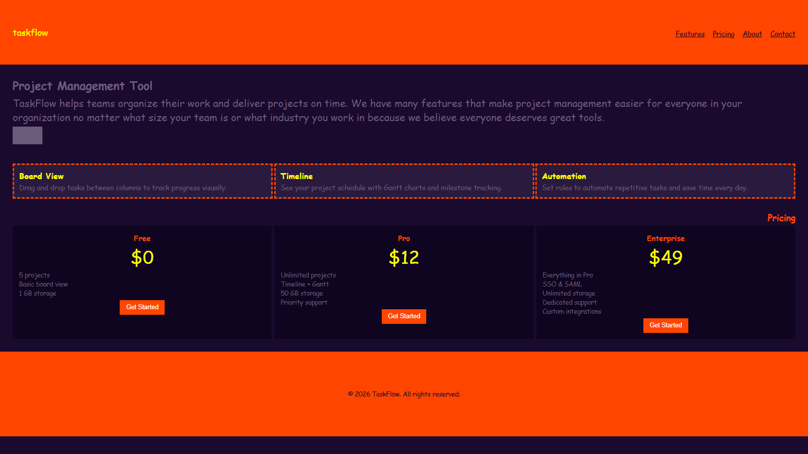
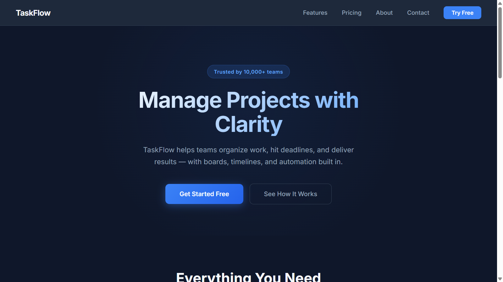
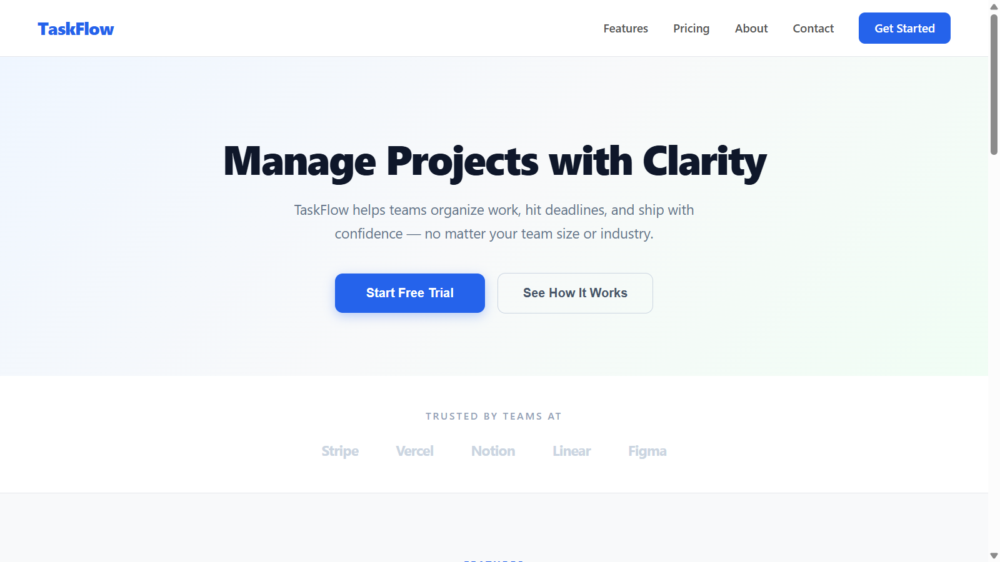
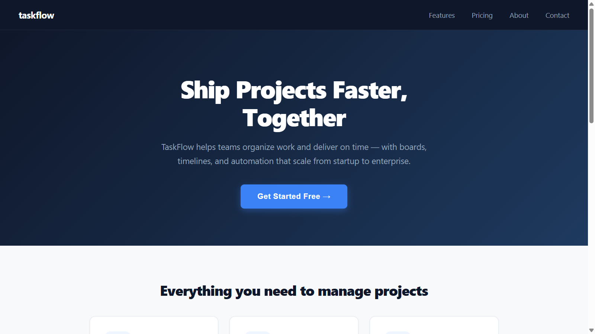
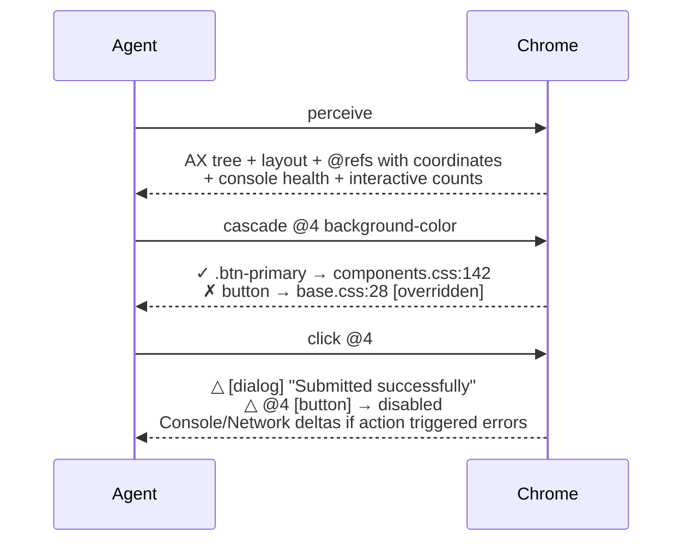
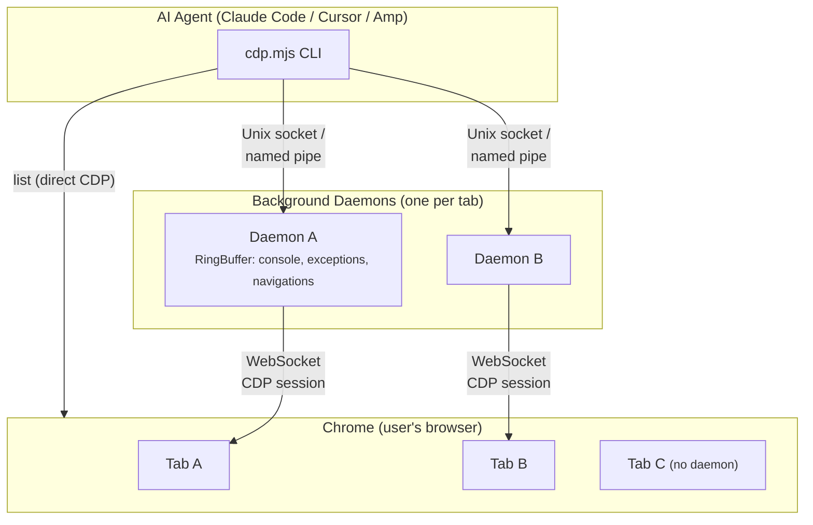
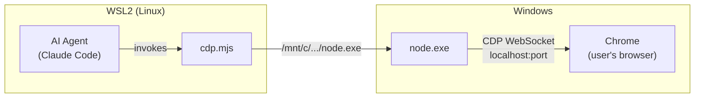

# chrome-cdp-ex

[](skills/chrome-cdp-ex/scripts/cdp.mjs)
[](skills/chrome-cdp-ex/scripts/cdp.mjs)
[](https://nodejs.org)
[](LICENSE)

> Most browser automation tools launch a clean, isolated browser.
> `chrome-cdp-ex` connects to your real browser session: tabs, logins, cookies, and current page state.

## Product direction

`chrome-cdp-ex` is designed as a live-page perception and control layer for agents. Playwright is still the right tool for deterministic isolated tests; this project focuses on real browser sessions, low-token perception, layout/style awareness, CSS source tracing, and action feedback. See `docs/strategy/agent-browser-vision.md` for the product compass.

## Use this when

Use `chrome-cdp-ex` when the agent needs to understand or act inside a browser that already matters.

- You need the user's real logged-in Chrome, Edge, Brave, Electron, or WSL2-to-Windows session.
- You want one low-token page read before choosing what to click, fill, inspect, or debug.
- You need action evidence: what changed after `click`, `fill`, `upload`, `nav`, `inject`, or `reload`.
- You need CSS source tracing from a visible element to the selector, stylesheet, and line.
- You want long-session memory: console/network buffers, network mocks, clock control, screenshots, reports, checkpoints, throttled network profiles, and replay.

## Do not use this when

Use Playwright instead when you need a clean, repeatable browser test from scratch.

| Use Playwright for | Use `chrome-cdp-ex` for |
|---|---|
| CI suites in isolated browsers | Live user sessions and authenticated tabs |
| Deterministic locators and assertions | Agent perception, diagnosis, and recovery |
| Cross-browser test matrices | Chrome/CDP/Electron inspection |
| Fresh state per test | Long-session debugging and handoff reports |

## Five success cases

| Case | What the agent does |
|---|---|
| Logged-in dashboard inspection | `doctor -> list -> perceive` reads the real dashboard without relogin or a copied screenshot. |
| Action evidence after form input | `fill` or `click` returns dispatch, settle, and DOM diff so the agent can choose the next step. |
| CSS source tracing | `cascade @ref background-color` shows the winning selector and source file/line to edit. |
| Long-session debugging | `status`, `netlog`, `mock`, `clock`, `throttle`, screenshots, and `report` preserve evidence across a live tab session. |
| Workflow capture and replay | `checkpoint`, `record-actions`, `export-playwright`, `diff-shot`, and `replay` turn exploration into reusable debugging and regression assets. |

## Why this exists

- **Perceive-first workflow:** one call gives structure, layout, styles, coordinates, and console health.
- **CSS origin tracing:** `cascade` tells the agent exactly which file and line to edit — not just what the style is, but where it comes from.
- **Low round-trip cost:** understand in 1 call, act in 1 call, verify automatically.
- **Live prototyping:** `inject` CSS/JS into the page, test changes visually, remove when done — no dev server restart.
- **Real-session automation:** no separate Chromium profile unless you want one.
- **Production-ready ergonomics:** daemon-per-tab, background event collection, WSL2-to-Windows support, Electron support.

## Contents

- [The Redesign Experiment](#the-redesign-experiment)
- [Use this when](#use-this-when)
- [Do not use this when](#do-not-use-this-when)
- [Five success cases](#five-success-cases)
- [Quick Start](#quick-start)
- [How It Works](#how-it-works)
- [Commands (68 total)](#commands-68-total)
- [WSL2 -> Windows Browser Control](#wsl2---windows-browser-control)
- [Dogfood Benchmark](#dogfood-benchmark)
- [Contributor Checks](#contributor-checks)
- [Credits](#credits)
- [License](#license)

## The redesign experiment

Same ugly page. Same prompt. 5 rounds. Three independent AI agents, each with a different browser observation tool.
**Only one variable changed: how much visual state each tool exposes.**

| Before | `chrome-cdp-ex` | Playwright | Other CDP |
|---|---|---|---|
|  |  |  |  |

The agent using `perceive` (layout + colors + spacing + coordinates) produced the most polished result because it could actually **see** what needed fixing, not just parse source code.
[**View the live comparison ->**](https://endeavoryen.github.io/chrome-cdp-ex/experiment/showcase.html)

### The numbers

| | `chrome-cdp-ex` | Playwright | Other CDP tools |
|---|---|---|---|
| **Calls to fully understand a page** | **1** (`perceive`) | 3+ (snapshot + console + viewport) | 2+ (snap + console) |
| **Tokens per page snapshot** | **~800** (with layout + styles) | ~3,500 (no layout, no styles) | ~400 (no layout, no styles) |
| **Calls to act and verify** | **1** (auto feedback) | 2+ (act + re-snapshot) | 2+ (act + re-snapshot) |
| **`@ref` with coordinates** | **Yes** - `@3 (200,350 200x30)` | No - `ref=e376` (ID only) | No |
| **Your real browser session** | **Yes** - tabs, cookies, logins | No - isolated Chromium | Varies |
| **CSS origin tracing** | **Yes** - `cascade` shows file:line | No | No |
| **Live CSS/JS injection** | **Yes** - `inject` with tracking + removal | No (page.evaluate only) | No |
| **Background event collection** | **Yes** - console, errors, navigations | Only while connected | No |
| **Electron app support** | **Yes** - `CDP_PORT=9222` | No | No |
| **WSL2 -> Windows** | **Yes** - built-in | No | No |
| **Dependencies** | **0** | Playwright + Chromium binary | Varies |
| **Commands** | **68** | N/A (programmatic API) | ~14 |

## One command, complete page understanding

Other tools either give a screenshot and say "figure it out" or dump an AX tree without context.
`perceive` gives agents everything needed in one call:

```text
$ cdp perceive abc1
📍 My App (1280x720 scroll:0/2400) — https://app.example.com
  [banner] ↕80px bg:rgb(26,26,46) ↑above fold
    [nav] flex
      @1 [link] "Home" (12,8 60x20)
      @2 [link] "Settings" (80,8 70x20)
  [main] ↕2920px
    @3 [textbox] "Email" (200,350 200x30)
    @4 [button] "Submit" (200,400 100x40)
  [contentinfo] ↕160px ↓below fold
Console: 2 errors | Interactive: 12 a, 3 button, 2 input
```

Structure. Layout. Styles. Scroll position. Console health. Interactive counts.
Each `@ref` includes bounding coordinates, all in about **~800 tokens**.

## "Which file do I edit to change this blue?"

Other tools can tell an agent *what* the page looks like. Only `cascade` tells it *why*:

```text
$ cdp cascade abc1 @4 background-color

background-color: #2563eb
  ✓ .btn-primary { background-color: #2563eb }
    → src/styles/components.css:142
  ✗ button { background-color: #e5e7eb }  [overridden]
    → src/styles/base.css:28
```

One command. Source file. Line number. Full cascade. The agent can now go directly to `components.css:142` and make the change — no guessing, no grepping through stylesheets.

Pair it with `inject` for live prototyping:

```text
$ cdp inject abc1 --css ".btn-primary { background: #dc2626 }"
inject-1

$ cdp inject abc1 --remove inject-1    # undo when done
```

## Why agents choose this


```mermaid
sequenceDiagram
    participant Agent
    participant Chrome

    Agent->>Chrome: perceive
    Chrome-->>Agent: AX tree + layout + @refs with coordinates<br/>+ console health + interactive counts

    Agent->>Chrome: cascade @4 background-color
    Chrome-->>Agent: ✓ .btn-primary → components.css:142<br/>✗ button → base.css:28 [overridden]

    Agent->>Chrome: click @4
    Chrome-->>Agent: △ [dialog] "Submitted successfully"<br/>△ @4 [button] → disabled<br/>Console/Network deltas if action triggered errors
```

**One call to understand. One call to trace CSS origin. One call to act. Zero extra calls to verify.**
Action feedback is automatic.

## Quick start

For the shortest first run, use [the Killer Path walkthrough](docs/examples/killer-path.md).

1. Clone and enter the repo.

```bash
git clone https://github.com/EndeavorYen/chrome-cdp-ex.git
cd chrome-cdp-ex
```

2. Install in Claude Code (choose one option).

```bash
# Option A: load in Claude Code for the current project/session
claude --plugin-dir .

# Option B: install globally for all projects
mkdir -p ~/.claude/skills
cp -r skills/chrome-cdp-ex ~/.claude/skills/
```

3. Run the onboarding check.

```bash
node skills/chrome-cdp-ex/scripts/cdp.mjs doctor
```

`doctor` starts with a `Wizard` summary: current onboarding status, the next command to run, and the golden path. It then checks Node 22+, install path, daemon state, open-file limit, CDP reachability, debuggable page targets, and whether browser debugging approval is already confirmed. Use `doctor --format json` when an agent or script needs the same onboarding status, checks, `wizard.commands`, consent-aware `recommendation` (`run`, `ask`, `after`, `consentRequired`, and warning commands), and next commands as a versioned `chrome-cdp-ex.doctor.v1` payload. Low open-file limits include structured recovery for the current shell (`ulimit -n 4096`) and, on macOS, the login session / GUI app limit (`sudo launchctl limit maxfiles 65536 200000`, requires admin). If no page is available it starts with `open`; if a target exists it prints the target prefix to use with `perceive`; if approval is not confirmed it tells you where Chrome may ask for "Allow debugging?". If CDP is not ready, use one of these paths:

- **Existing browser session (preferred):** open `chrome://inspect/#remote-debugging` (or `edge://inspect`) and toggle remote debugging on. Cleanest path; touches no profile state.
- **Isolated debug profile (when the toggle path doesn't work):** `node skills/chrome-cdp-ex/scripts/cdp.mjs spawn-debug-browser edge --port 9222 --url https://example.com`. Spawns the browser with `--remote-debugging-port` and a disposable `--user-data-dir`, leaving your main profile alone. Use `--exe /path/to/browser` for non-standard installs; Linux also falls back to common browser names on `$PATH`. Run `cdp doctor` first to confirm no port conflict.
- **Electron app:** start it with `--remote-debugging-port=<port>` and run with `CDP_PORT=<port>`.

4. Follow the golden path.

```bash
node skills/chrome-cdp-ex/scripts/cdp.mjs doctor
node skills/chrome-cdp-ex/scripts/cdp.mjs list
node skills/chrome-cdp-ex/scripts/cdp.mjs open https://example.com   # only if list is empty; add --format json for scripts
node skills/chrome-cdp-ex/scripts/cdp.mjs perceive <target> -C -d 8
node skills/chrome-cdp-ex/scripts/cdp.mjs click <target> @ref        # or fill <target> <selector> <text>
node skills/chrome-cdp-ex/scripts/cdp.mjs perceive <target> --since-action
node skills/chrome-cdp-ex/scripts/cdp.mjs report <target>            # add --format json for agent handoff
```

`open` prints the new target prefix plus `Next:`, `Then:`, and `Report:` continuation hints. If Chrome approval times out, it keeps the tab and prints the exact `perceive <target> -C -d 8` retry command. Use `open --format json` when an agent or script needs the versioned `chrome-cdp-ex.open.v1` handoff payload with target prefix, approval state, auto-perceive status, a golden-path `recommendation`, and executable `nextSteps`; when auto-perceive succeeds, `nextSteps` starts at the action step instead of repeating `perceive`.
Use `list --format json` when an agent or script needs target IDs, stable prefixes, blank-tab labels, a golden-path `recommendation`, and executable `nextSteps` without parsing the human table. Use `perceive --format json` when the agent needs structured refs plus executable `nextSteps` for `click/fill -> perceive --since-action -> report` without parsing the text tree.

If a CLI command fails, read the printed `Recovery:` block first: `Kind` names the failure class, `Strategy` says how to recover, `Run` is the primary command, and `Then` appears when a follow-up is useful. The legacy `Next:` line is still printed as the shortest copy-pasteable command. Add `--format json` when a script needs the versioned `chrome-cdp-ex.cli-error.v1` handoff with `recovery` and `nextSteps` instead of human text. Common setup, target, daemon, CDP, and `EMFILE` / "Too many open files" errors are formatted this way instead of dumping a stack trace; fd-limit recovery includes the shell `ulimit -n 4096` command and, on macOS, the `sudo launchctl limit maxfiles 65536 200000` login-session command.

**Requires:** Node.js 22+ (uses built-in WebSocket). Auto-detects Chrome, Chromium, Brave, Edge, and Vivaldi on macOS, Linux (including Flatpak), and Windows.

<details>
<summary><strong>Electron App Support</strong></summary>

Connect to Electron apps exactly like Chrome, as long as remote debugging is enabled.

**Step 1: Enable CDP in your Electron app** (dev mode only)

```js
// In your main process (e.g. src/main/index.ts)
if (process.env.NODE_ENV === 'development') {
  app.commandLine.appendSwitch('remote-debugging-port', '9222');
}
```

Or launch with a flag:

```bash
# macOS/Linux
electron . --remote-debugging-port=9222

# Windows (PowerShell)
electron . --remote-debugging-port=9222
```

**Step 2: Connect**

```bash
CDP_PORT=9222 cdp.mjs list
```

Output:

```text
[Electron 33.4.11]
1ED3DBAA  My App                                                  http://localhost:5173/#/menu
```

All 68 commands work: `help`, `perceive`, `frame`, `overlay`, `click`, `fill`, `cascade`, `record`, `checkpoint`, `restore`, `record-actions`, `export-playwright`, `diff-shot`, `replay`, `mock`, `clock`, `throttle`, `report`, `inject`, `flow`, `repeat`, `doctor`, and more.

</details>

<details>
<summary><strong>Advanced Configuration</strong></summary>

- `CDP_PORT` - connect to a specific port (Electron, Chrome with `--remote-debugging-port`, etc.)
- `CDP_PORT_FILE` - override the `DevToolsActivePort` file path
- `CDP_HOST` - override the target host (default: `127.0.0.1`)

</details>

## How It Works


```mermaid
graph TB
    subgraph Agent["AI Agent (Claude Code / Cursor / Amp)"]
        CLI["cdp.mjs CLI"]
    end

    subgraph Daemons["Background Daemons (one per tab)"]
        D1["Daemon A<br/><small>RingBuffer: console, exceptions, navigations</small>"]
        D2["Daemon B"]
    end

    subgraph Chrome["Chrome (user's browser)"]
        T1["Tab A"]
        T2["Tab B"]
        T3["Tab C <small>(no daemon)</small>"]
    end

    CLI -- "list (direct CDP)" --> Chrome
    CLI -- "Unix socket /<br/>named pipe" --> D1
    CLI -- "Unix socket /<br/>named pipe" --> D2
    D1 -- "WebSocket<br/>CDP session" --> T1
    D2 -- "WebSocket<br/>CDP session" --> T2
```

Each tab gets its own daemon process that keeps the CDP session open.
Chrome's "Allow debugging" dialog appears **once per tab**, not once per command.
Daemons auto-exit after 20 minutes of inactivity and passively collect console/exception/navigation events into ring buffers.

## Commands (68 total)

Tip: start with `perceive`, then use `click`/`fill`/`select`; use `status` or `console` when you need debugging context.

### MUD / game / long-session recipes

`chrome-cdp-ex` was hardened against real long-session play feedback (15–20 minute MUD playtests, combat logs, modals that share keys with global hotkeys). Patterns the tool now supports first-class:

```bash
# Advance through dialogue / cutscenes safely (fail-fast on first error):
cdp repeat <t> 5 press space

# Fire a hotkey N times, keep going past transient misses:
cdp repeat <t> 8 --continue press c

# Pass CJK / shell-hostile expressions without quoting headaches:
B64=$(printf '%s' 'document.title.includes("戰鬥勝利")' | base64)
cdp eval64 <t> "$B64"
cdp eval   <t> --b64 "$B64"

# Click via HTMLElement.click() when an overlay blocks the realistic mouse path
# (common for modals that paint over their own buttons):
cdp jsclick <t> @17
cdp click   <t> --js "button[data-action='confirm']"

# Wait for a combat log line, then snapshot the result:
cdp waitfor <t> --any-of "戰鬥勝利|戰敗|逃跑成功" 60000 --scope ".combat-log"
cdp waitfor <t> --selector-stable ".combat-log" 3000 60000
cdp text    <t> ".combat-log"

# Capture cause-and-effect of a single action (DOM + network + console):
cdp record <t> --action click @5 --until "dom stable"

# Dismiss MOTD / modal without firing the underlying game's hotkey:
cdp dismiss-modal <t>     # close button → Escape fallback (NEVER Space)
```

**Sequence capture pattern** — fold these into a single readable transcript with `flow`:

```bash
cdp flow <t> "perceive -i; click @5; wait dom stable; perceive --since-action; text .combat-log"
```

For a multi-turn loop where you want fail-fast safety per turn, layer `repeat` over `flow` — the inner `flow` body becomes one "turn", and `repeat` halts on the first turn that fails:

```bash
# 3 combat turns; each turn clicks attack, waits for the DOM to settle, then
# checks the log. Quoting matters: the whole flow body is a single arg.
cdp repeat <t> 3 flow "click button[data-act='attack']; wait dom stable; text .combat-log"

# Single-command body is fine too — fail-fast on first stale @ref:
cdp repeat <t> 3 click @attackBtn
# When the DOM rewrites @5 between turns, switch to a stable selector instead:
cdp repeat <t> 3 click "button[data-act='attack']"
```

`repeat` allows wrapping `flow` (one-level nesting) but still refuses to wrap `repeat`, `batch`, or `stop` — those would either recurse or corrupt the daemon IPC stream.

**Stale `@ref` reminder** — refs are short-lived handles assigned by `perceive`. They do **not** auto-remap after navigation, Vite HMR, or large DOM mutations. The error you'll see is now classified (e.g. `Unknown ref: @31. Refs were cleared because the page navigated/reloaded …`). Honour it: re-run `perceive`, or — for any loop longer than 1–2 immediate actions — use a stable CSS selector. `repeat` does not retry around stale refs because remapping a ref to "the new equivalent" cannot be done correctly without agent context.

<details>
<summary><strong>Discovery & Lifecycle</strong></summary>

```bash
help                              # show the command reference
list [--format json]               # list open tabs (targetId prefixes; about:blank is "(blank tab)")
                                   # JSON gives schema/pages/recommendation/nextSteps for agents
open   [url] [--format json]       # open new tab; JSON gives target/approval/recommendation/nextSteps handoff
spawn-debug-browser [edge|chrome|brave] [--port 9222] [--url URL] [--profile-dir DIR] [--exe PATH]
                                   # launch an isolated debug profile (disposable user-data-dir + remote-debugging-port)
                                   # `spawn` is a short alias
stop   [target]                    # stop daemon(s)
closetab <target>                  # close a browser tab
keepalive <target> <ms>            # extend a tab daemon lifetime for long background work
doctor / ready [--format json]     # one-call diagnostics (no target needed)
                                   # checks: Node 22+, install, daemon sockets, fd limit, CDP reachability, browser permission
                                   # prints OK/WARN/FAIL plus Recommendation/Next steps; JSON gives schema/checks/wizard/recommendation/nextSteps
```

</details>

<details open>
<summary><strong>Perception</strong> - start here</summary>

```bash
perceive <target> [flags] [--format json] # enriched AX tree with @ref indices + top-level viewport CSS coordinates
                                   #   --diff: show only changes since last perceive
                                   #   --since-action: show changes caused by the last mutating command
                                   #   JSON + --diff/--since-action returns chrome-cdp-ex.perceive-diff.v1
                                   #   --frame @fN: perceive inside an iframe; refs become @fN:M
                                   #   -s <sel>: scope to CSS selector subtree
                                   #   -i: interactive elements only
                                   #   -d N: limit tree depth
                                   #   -C: include non-ARIA clickable elements
                                   #   --keep-refs: preserve every @ref line under truncation
                                   #   --last N: keep last text/log rows plus high-signal errors/results
                                   # Coords are top-level viewport CSS pixels — same space as clickxy.
                                   # Fixed/sticky elements get a ", fixed"/", sticky" tag.
snap     <target> [--full]         # accessibility tree (compact by default)
summary  <target> [--format json]  # token-efficient overview (~100 tokens)
frame    <target> [--format json]  # frame tree with @fN refs (alias: frames)
perceive <target> --frame @f2      # observe iframe contents; click/fill/cascade can use @f2:1 refs
overlay  <target> [sel|@ref] [--format json] # detect dialogs/overlays and target blockers
report   <target> [--format json]  # session action timeline + evidence summary + screenshots + Recommendation/Next steps
checkpoint <target> [--format json] # capture URL, cookies, localStorage, and sessionStorage
restore  <target> --file <path> [--format json] # restore a checkpoint artifact into the live page
record-actions <target> [--format json] # export action log + mock/clock/throttle environment steps
export-playwright <target> [--format json] # export workflow as a Playwright spec draft or JSON handoff
diff-shot <target> [--reset] [--threshold pct] # viewport pixel diff against last diff-shot baseline
replay   <target> --file <path> [--format json] # replay a record-actions JSON artifact
mock     <target> [add|clear]      # mock matching network requests in this live tab
clock    <target> [freeze|offset|reset] # override Date/time in this live tab
throttle <target> [off|offline|slow-3g|fast-3g|lte|custom] # emulate network conditions for this tab
status   <target> [--runtime] [--format json]  # URL, title + new console/exception entries; --runtime adds Performance metrics
console  <target> [--all|--errors] [--format json] # console buffer (default: unread only; preserves log/warn/error/debug levels)
text     <target>                            # clean text content (strips scripts/styles/SVG)
text     <target> "main, [role=main], #app .main"   # fallback chain — first match wins
text     <target> --auto                     # heuristic main-content extraction (no nav/aside/footer)
text     <target> --auto --exclude ".sidebar,.banner"
text     <target> --root auto "header"       # scope to #root/[data-reactroot]/main/body; header falls back to banner/h1/h2
table    <target> [selector]       # full table data extraction (tab-separated)
```

</details>

<details>
<summary><strong>Visual Capture</strong></summary>

```bash
shot     <target> [file] [--quiet|--verbose|--annotate]
                                   # viewport screenshot. By default the saved path is on the
                                   # FIRST line of stdout (good for `head -1`), followed by a short DPR hint.
                                   # If [file] is omitted, the screenshot is saved under the
                                   # session screenshot dir and appears in `report <target>`.
                                   # --quiet  print ONLY the saved path
                                   # --verbose include the full coordinate-mapping tutorial
                                   # --annotate overlay @ref labels onto the screenshot
diff-shot <target> [--reset] [--threshold pct] [--format json]
                                   # first call captures a baseline; next calls save current + diff PNGs.
                                   # Pixel diff only: use perceive/cascade/report to explain semantic cause.
elshot   <target> <sel|@ref>        # element screenshot (auto scroll + clip, no DPR issues)
scanshot <target>                   # segmented full-page (readable viewport-sized images)
fullshot <target> [file]            # single full-page image (may be tiny on long pages)
```

</details>

<details>
<summary><strong>Inspection</strong></summary>

```bash
html      <target> [selector]       # full HTML or scoped to CSS selector
eval      <target> <expr>           # evaluate JS in page context
eval      <target> --b64 <base64>   # decode UTF-8 base64 first
eval      <target> --fire-and-forget <expr>  # dispatch async/background JS without awaiting its promise
call      <target> <expr|fn>        # await expression/function result and print JSON when possible
styles    <target> <selector>       # computed styles (meaningful props only)
net       <target>                  # network performance entries
netlog    <target> [--clear]        # network request log (XHR/Fetch with status + timing)
mock      <target> add "**/api/*" --status 503 --body '{"ok":false}' --content-type application/json
mock      <target>                  # show active mock rules and recent hits
mock      <target> clear            # disable all network mocks
clock     <target> freeze --at 2020-01-02T03:04:05.000Z
clock     <target> offset --ms 3600000
clock     <target> reset
throttle  <target> slow-3g|fast-3g|lte|offline|off
throttle  <target> custom --latency 120 --download 256 --upload 128
cookies   <target>                  # list cookies for current page
cookieset <target> <cookie>         # set a cookie ("name=value; domain=...")
cookiedel <target> <name>           # delete a cookie by name
```

</details>

<details>
<summary><strong>Interaction</strong></summary>

```bash
click   <target> <sel|@ref> [--format json] # click element (CDP mouse events, not el.click())
click   <target> --js <sel|@ref> [--format json] # JS-fallback: HTMLElement.click() — bypasses overlays/hit-testing
jsclick <target> <sel|@ref> [--format json] # alias for click --js
clickxy <target> <x> <y> [--format json] # click at CSS pixel coordinates
type    <target> <text> [--format json]  # type at focused element (cross-origin safe)
press   <target> <key> [--format json]   # press key (Enter, Tab, Escape, Backspace, Space, Arrow*,
                                    # AND single characters a-z / A-Z / 0-9 / common punctuation)
scroll  <target> <dir|x,y> [px] [--format json] # scroll (down/up/left/right; default 500px)
hover   <target> <sel|@ref>         # hover (triggers :hover, tooltips)
fill    <target> <sel|@ref> <text> [--format json] # clear field + type (form filling)
fill    <target> --react <sel|@ref> <text> [--format json] # native value setter + input/change events for React controlled inputs
wait    <target> <ms>               # delay inside cdp; also supports: cdp wait <ms> [target]
select  <target> <selector> <val> [--format json] # select dropdown option by value
waitfor <target> <selector> [ms]              # wait for element to appear (default 10s)
waitfor <target> --gone <sel|@ref> [ms]       # wait for element to DISAPPEAR
waitfor <target> --text "str" [--scope sel] [ms]  # wait for text to appear
waitfor <target> --any-of "a|b|c" [ms] [--scope sel]  # any of the alternatives appears
waitfor <target> --selector-stable <sel> [stableMs] [timeoutMs]  # wait until selector stops mutating
dismiss-modal <target>              # close visible modal/dialog safely (close button, fallback Escape)
loadall <target> <selector> [ms]    # click "load more" until gone
upload  <target> <selector> <paths> [--format json] # upload file(s) to <input type="file">
dialog  <target> [accept|dismiss]   # dialog history; set auto-accept or auto-dismiss
```

</details>

<details>
<summary><strong>Navigation & Viewport</strong></summary>

```bash
nav      <target> <url>             # navigate to URL and wait for load
back     <target>                   # navigate back in browser history
forward  <target>                   # navigate forward
reload   <target>                   # reload current page and clear console/exception/navigation buffers
viewport <target> [WxH]             # show or set viewport size (e.g. 375x812)
```

</details>

<details>
<summary><strong>Frontend Development</strong> (v2.2.0)</summary>

```bash
inject  <target> --css "<text>"     # inject inline <style> with tracking
inject  <target> --css-file <url>   # inject <link rel="stylesheet">
inject  <target> --js-file <url>    # inject <script src> and wait for load
inject  <target> --remove [id]      # remove injected element(s) — all or by id
cascade <target> <sel|@ref>         # CSS origin tracing: full cascade with source file + line
cascade <target> <sel|@ref> <prop>  # filter to one property (e.g. "background-color")
record  <target> [ms]               # timeline of DOM/console/network/navigation events
record  <target> --action click @5  # record cause → effect around an action;
                                    # auto-settles when no duration/--until given
                                    # (cap: 5s without network activity, 10s with)
record  <target> --until "dom stable"|"network idle"  # record until quiet (max 30s)
report  <target> [--format json]    # current daemon session action timeline + JSONL log path
checkpoint <target> [--format json] # save URL, cookies, localStorage, and sessionStorage as an artifact
restore <target> --file <path> [--format json] # restore a checkpoint artifact; invalidates @refs
record-actions <target> [--format json]  # export action log + mock/clock/throttle environment steps
export-playwright <target> [--format json] # export workflow as a Playwright spec draft or JSON handoff
diff-shot <target>                # compare current viewport screenshot with last diff-shot baseline
replay  <target> --file <path> [--format json] # execute replayable steps from a record-actions JSON artifact
```

`inject` returns an ID (`inject-1`, `inject-2`...) for targeted removal. URLs are validated (blocks `data:`, `file:`, cloud metadata).

`cascade` shows which CSS rule won, which were overridden, inline styles, and inherited properties — with source locations. Answers "which file do I edit?" in one call. For Vite / CSS Modules pipelines, `cascade` also reads inline base64 source maps and stripped `?vue&type=style&…` query suffixes, so locations resolve to the original `*.module.css` / `*.vue` source instead of an opaque stylesheet id.

</details>

<details>
<summary><strong>Advanced</strong></summary>

```bash
batch   <target> <cmds> [flags] [--format json] # multi-command call; --format json gives chrome-cdp-ex.batch.v1
                                    # pipe:    'fill @3 hi | click @7'
                                    # JSON:    '[{"cmd":"click","args":["@1"]},{"cmd":"perceive","args":["--diff"]}]'
                                    # --parallel  read-only/extraction commands only; mutating commands are rejected
                                    # --plain     human-readable, indented per step
                                    # --compact   one line per step
flow    <target> "<steps>" [--format json] # sequential pipeline; semicolon-separated steps; halts on first error
                                    # e.g. flow <t> "click @1; wait dom stable; summary; console --errors"
                                    # wait aliases: "wait dom stable", "wait network idle"
                                    # JSON: chrome-cdp-ex.flow.v1 with failedStep/skipped/nextSteps
repeat  <target> <N> <cmd> [args]   # run a single command up to N times (cap 50). Fail-fast by default.
                                    # --continue / -c  keep going through errors and report tally
                                    # e.g. `repeat <t> 5 press space` to advance MUD dialogue
                                    # NOTE: refs are NOT auto-remapped between iterations — use stable
                                    # selectors if the DOM mutates during the loop.
eval    <target> <expr>             # evaluate JS in page context
eval    <target> --b64 <base64>     # decode UTF-8 base64 first (CJK / shell-hostile transport)
eval    <target> --fire-and-forget <expr>  # start async/background JS; returns after dispatch; keeps daemon alive 1h
eval64  <target> <base64>           # alias for `eval --b64`
call    <target> <expr|fn>          # await page function/expression result, including promises, as JSON when possible
evalraw <target> <method> [json]    # raw CDP command passthrough
                                    # e.g. evalraw <t> "DOM.getDocument" '{}'
```

</details>

**Action feedback:** mutating commands such as `click`, `fill`, `type`, `press`, `select`, `scroll`, `upload`, `nav`, `back`, `forward`, `reload`, `viewport`, `inject`, and `dismiss-modal` now return compact `ActionResult` evidence plus a `perceive` diff, full perceive, or bounded page observation when appropriate. `reload` uses a lightweight title/url/ready-state observation so live sessions do not hang on full AX-tree collection after navigation churn. Add `--format json` to these actions when an agent needs the versioned `chrome-cdp-ex.action.v1` evidence model without dispatch text; the model includes top-level `outcome` (`changed`, `no-change`, `attention`, `failed`, `timeout`, or `dispatched`), `verdict` (`continue`, `investigate`, `recover`, `blocked`, or `verify`), `recommendation`, and `nextSteps` so agents can decide whether to continue, recover, hand off to `report --format json`, or capture `record-actions --format json` without parsing `nextHint`. A dispatched `no-change` outcome is not treated as normal success: its recommendation asks the agent to inspect `overlay`, `frame`, a fresh `perceive`, and `report` before retrying, and session reports promote the latest `no-change` outcome when no harder diagnosis is present. Dispatch failures are returned as the same JSON model with `dispatch.ok=false`, `effects.failure.kind`, and an executable `nextHint`; when a diagnosis exists, `recommendation.source` becomes `action-diagnosis` and `nextSteps` are promoted from the diagnosis recovery policy. Action JSON also includes `effects.diagnosis` (`chrome-cdp-ex.action-diagnosis.v1`) when the action needs attention, such as `network-failure`, `network-pending`, `exception`, `console-error`, `observation-timeout`, or a classified dispatch failure. Each diagnosis includes `recovery` (`chrome-cdp-ex.recovery-policy.v1`) with a strategy, priority, ordered commands, verification command, and avoid list so agents can choose `netlog`, `console --errors`, `overlay`, `frame`, `perceive --since-action`, `report --format json`, or another recovery command without parsing prose. Each action snapshots console, exception, and network buffers before dispatch, then reports low-token deltas such as `Console: 1 entry (1 error)`, `Network: 1 request (1 failed)`, or `Network: 1 request (1 pending)` when the action triggers runtime errors, failed requests, or requests that have not settled yet. After any mutating command, `perceive --since-action` replays the page diff from that action's pre-dispatch baseline, so agents can ask "what changed because of the last action?" without guessing from the last manual perceive; add `--format json` for the versioned `chrome-cdp-ex.perceive-diff.v1` evidence model. Use `batch <target> --format json ...` when combining several steps in one call; it returns `chrome-cdp-ex.batch.v1` with per-step status/verdict, attention counts for successful action verdicts such as `no-change`, the first failed step, classified `Action failure` kind, and executable `nextSteps`. Use `flow <target> --format json "summary; click #missing; status"` for ordered wait/action pipelines; it returns `chrome-cdp-ex.flow.v1` with per-step status/verdict, attention counts for successful action verdicts such as `no-change`, the failed step, skipped downstream steps, classified `Action failure` kind when available, and executable `nextSteps`. Use `report <target>` after a multi-step flow to see the session action timeline, outcome, verdict, evidence summary, console/network diagnostics, classified failures, session screenshot attachments, per-target JSONL log path, and a text `Recommendation` / `Next steps` handoff; use `report <target> --format json` when an agent needs the versioned `chrome-cdp-ex.report.v1` handoff model with a `recommendation` and `nextSteps` derived from the latest diagnosis recovery policy. Use `checkpoint <target> --format json` before risky stateful exploration, then `restore <target> --file checkpoint.json` to return to the captured URL, cookies, localStorage, and sessionStorage; restore invalidates `@ref`s, so run `perceive` again before using refs. Use `record-actions <target> --format json` when the current session should become a replay/export asset; the artifact includes replayable `mock`, `clock`, and `throttle` environment controls before the action steps, and each action preserves its outcome, verdict, and diagnostics while failed dispatches stay as diagnostic evidence and are marked non-replayable. `export-playwright <target>` drafts a Playwright spec from the portable subset, including network mocks as `page.route` and initial `expect(page.getByText(...)).toBeVisible()` assertions from clear action-evidence text additions when possible, while non-portable live-browser controls are left as review comments; add `--format json` for `chrome-cdp-ex.export-playwright.v1`, which wraps the generated spec with exported/skipped counts, assertion counts, review notes, and next-step commands for agents. Use `diff-shot <target>` when a fallback visual pixel diff is needed, `mock <target> add "**/api/*" --status 503 --body '{"ok":false}'`, `clock <target> freeze --at ...`, and `throttle <target> slow-3g|offline|off` to keep network- and time-sensitive debugging reproducible, then `replay <target> --file artifact.json` to apply environment controls first and run replayable steps against the live page. `report <target>` shows the current mock, clock, and throttle profiles so long sessions do not forget a modified tab; reset with `mock <target> clear`, `clock <target> reset`, and `throttle <target> off` after the experiment. Commands that lack enough original input are marked with explicit missing fields instead of being silently guessed. Password-like fill/type targets are redacted before action artifacts are written. In text mode, if an action fails before dispatch completes, the error is classified as `stale-ref`, `overlay`, `wrong-frame`, `navigation`, `dom-rewrite`, `timeout`, or `selector` and includes a concrete `Next:` command such as `cdp dismiss-modal <target>`, `cdp overlay <target> @ref`, `cdp perceive <target> -C -d 8`, or `cdp status <target>`. If the action was sent but the post-action observation times out during a React rerender or navigation churn, the command reports `success but observation timed out` with any console/network diagnostics already captured, so agents should verify with `perceive --since-action`, `perceive --diff`, or `status` rather than retrying the action.

`upload <target> <selector> <paths> --format json` is part of the action-evidence path: after setting files, it reports the observed form preview, validation, or upload-queue change as `ActionResult` evidence.

`restore <target> --file checkpoint.json --format json` is part of the action-evidence path too: it returns a versioned `chrome-cdp-ex.action.v1` result so agents know the checkpoint was dispatched, settled, and handed off to `report --format json`.

`replay <target> --file artifact.json --format json` returns a versioned `chrome-cdp-ex.replay.v1` handoff with environment/action counts, ok/failed/skipped totals, attempted steps, the failed step, and recovery next steps.

Use `wait` instead of shell `sleep` when policy blocks long sleeps:

```bash
cdp wait <target> 30000
cdp wait 30000 <target>
cdp wait 30000
```

Use `call` for page-level functions whose results matter, and `eval --fire-and-forget` for intentional background loops:

```bash
cdp call <target> "async () => window.app.getState()"
cdp eval <target> --fire-and-forget "setInterval(() => window.tick?.(), 1000)"
cdp keepalive <target> 3600000
```

`<target>` is a unique targetId prefix from `list`. See [SKILL.md](skills/chrome-cdp-ex/SKILL.md) for detailed usage patterns and coordinate-system notes.

## WSL2 -> Windows Browser Control

This tool works across the WSL2-to-Windows boundary, where many CDP tools fail.


```mermaid
graph LR
    subgraph WSL2["WSL2 (Linux)"]
        Agent["AI Agent<br/>(Claude Code)"]
        Script["cdp.mjs"]
    end

    subgraph Windows["Windows"]
        Node["node.exe"]
        Chrome["Chrome<br/>(user's browser)"]
    end

    Agent -- "invokes" --> Script
    Script -- "/mnt/c/.../node.exe" --> Node
    Node -- "CDP WebSocket<br/>localhost:port" --> Chrome
```

The key insight: WSL2 cannot connect to Windows `localhost` directly, so the script runs **Windows-side `node.exe`** via `/mnt/c/...` and lets that process connect to Chrome natively.

Proven pattern:

1. Start Chrome **on Windows** and enable debugging at `chrome://inspect/#remote-debugging`.
2. Use **Windows-side Node.js** to run the CDP script.
3. Locate Node.js:
   ```bash
   powershell.exe -NoProfile -Command "(Get-Command node -ErrorAction SilentlyContinue).Source"
   ```
4. Convert to a WSL mount path and invoke:
   ```bash
   "/mnt/c/.../node.exe" scripts/cdp.mjs list
   ```

See [SKILL.md](skills/chrome-cdp-ex/SKILL.md) for full WSL2 setup instructions.

## Dogfood Benchmark

Use the live benchmark before making performance or adoption claims:

### Latest dogfood snapshot

Local run on 2026-06-16, measured with the same smoke page and measured local comparison baselines:

| Metric | Latest run |
|---|---:|
| Total time | 8.996s |
| First useful observation | 1.451s |
| Golden path complete | 3.080s |
| Useful observation tokens | 2,663 |
| Action evidence coverage | 100% (4/4 mutating commands) |
| Quality gate | 11/11 pass |
| Differentiator success rate | 100% |
| Stale-ref recovery | 51ms, 1/1 recovered |
| Session stability sample | 1.648s, 3 probes |

Regenerate this table after meaningful command, perception, or benchmark changes:

```bash
npm run benchmark:killer
npm run benchmark:killer -- --json
npm run benchmark:killer -- --stability-ms 1200000
npm run benchmark:generic-cdp -- --out generic-cdp-raw.json
npm run benchmark:playwright -- --out playwright-raw.json
npm run benchmark:baseline -- playwright-raw.json generic-cdp-raw.json --out baselines.json
npm run benchmark:killer -- --comparison-baselines ./baselines.json
```

It launches a disposable debug browser against the local smoke page and measures the Killer Path: `doctor -> list -> perceive -> act -> since-action evidence -> report`. The JSON report includes command calls, total time, first useful observation time, first action evidence time, golden path completion time, estimated output tokens, useful observation tokens, auto-evidence actions, observed action evidence coverage, verification calls saved, report timeline presence, stale-ref recovery, session stability sample, and differentiator probes for modal/overlay detection, frame refs, CSS source tracing, and HMR/SPA DOM-update diff success/time. The default stability sample is 1000ms; use `--stability-ms` for 20-60 minute dogfood windows.

The report also includes a `chrome-cdp-ex.benchmark-gate.v1` quality gate. The default gate requires: successful run, at most 20 command calls, first useful observation within 5 seconds, golden path completion within 2 minutes, useful observation tokens at or below 3000, at least one auto-evidence action, 100% evidence coverage for every observed mutating command, a report timeline, 100% differentiator probe success, 100% stale-ref recovery, and a passing session stability sample. Treat a failed gate as a stop sign before publishing comparison claims.

JSON output also includes `chrome-cdp-ex.benchmark-comparison.v1`: a conservative `heuristic-smoke-baseline` comparison against Playwright test generation/snapshots, manual DevTools inspection, and generic CDP scripting. Treat it as a planning baseline until dedicated competitor harnesses exist; it is meant to show what must be proven, not to overstate external measurements.

To replace the heuristic comparison with measured competitor runs, either pass `--comparison-baselines` a `chrome-cdp-ex.comparison-baselines.v1` file directly, or normalize one or more raw harness result files with `npm run benchmark:baseline -- playwright-raw.json generic-cdp-raw.json --out baselines.json`. Raw result files use `{"schema":"chrome-cdp-ex.raw-baseline-results.v1","source":"measured-local-baseline","runs":[{"id":"playwright","label":"Measured Playwright harness","commandCalls":24,"usefulObservationTokens":4200,"verificationCallsSaved":0,"differentiatorSuccessRate":0.5}]}`.

`npm run benchmark:generic-cdp -- --out generic-cdp-raw.json` launches the same smoke page in a disposable browser and measures a naive raw-CDP path using `/json`, `Runtime.evaluate`, and WebSocket calls. You can also import an external transcript with `npm run benchmark:generic-cdp -- --from-steps steps.json --out generic-cdp-raw.json`. Feed the resulting raw file into `benchmark:baseline`, then into `benchmark:killer`, to make generic-CDP comparisons measured instead of heuristic. Measured baselines can carry capability metrics too; comparison reports surface gaps such as missing action evidence, report timelines, stale-ref recovery, or session stability so cheap-but-thin baselines do not look equivalent.

`npm run benchmark:playwright -- --out playwright-raw.json` measures a Playwright Chromium path against the same smoke page when the local environment has the `playwright` package available. If Playwright is not installed in the project, use `npm run benchmark:playwright -- --from-steps playwright-steps.json --out playwright-raw.json` to normalize an external Playwright transcript without adding a dependency.

## Contributor Checks

Run these before changing command behavior or docs:

```bash
npm test
npm run lint
npm run check:docs
npm run smoke:live
```

## Credits

- **Original**: [pasky/chrome-cdp-skill](https://github.com/pasky/chrome-cdp-skill) by Petr Baudis (daemon-per-tab architecture and core CDP client)
- **Contributors**: [ynezz](https://github.com/ynezz) (Flatpak paths), [Jah-yee](https://github.com/Jah-yee), [Rolf Fredheim](https://github.com/rolfredheim)
- **This fork**: `@ref` system, perceive-first workflow, action feedback, background observation, realistic input simulation, form automation, WSL2 support, and 28 additional commands

## License

[MIT](LICENSE)
