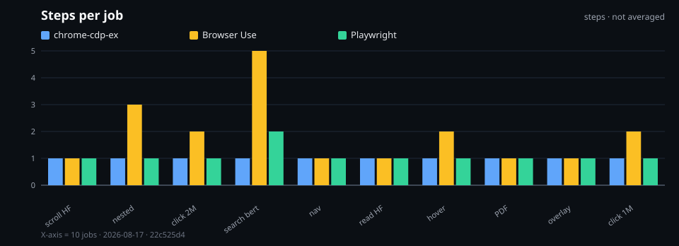
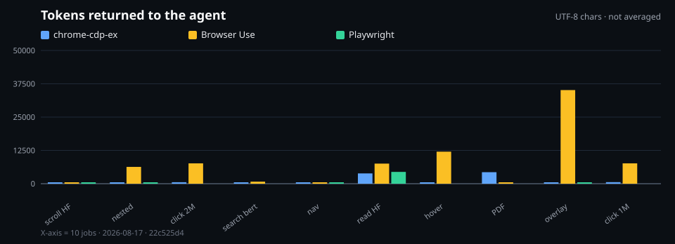
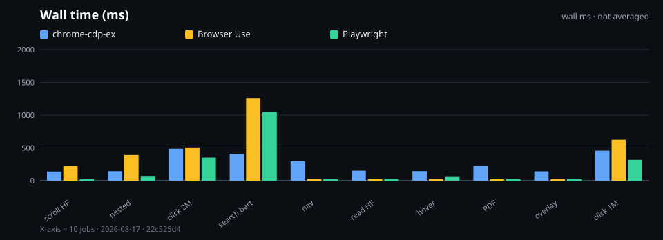

# chrome-cdp-ex

[](skills/chrome-cdp-ex/scripts/cdp.mjs)
[](https://nodejs.org)
[](https://github.com/EndeavorYen/chrome-cdp-ex/releases/tag/v2.16.0)
[](LICENSE)

<p align="center">
  <a href="experiment/codex-killer-path-demo.mp4"></a>
</p>

<p align="center">
  <strong><a href="experiment/codex-killer-path-demo.mp4">Watch the 60-second Codex demo →</a></strong>
</p>

<p align="center">
  <a href="https://endeavoryen.github.io/chrome-cdp-ex/experiment/showcase.html"></a>
  <a href="https://endeavoryen.github.io/chrome-cdp-ex/experiment/showcase.html"></a>
  <a href="https://endeavoryen.github.io/chrome-cdp-ex/experiment/showcase.html"></a>
</p>

<p align="center">
  <sub>Same ugly page. Same prompt. The middle one is chrome-cdp-ex — the agent could see layout, color, and contrast.</sub>
</p>

## The tab you already have

**Use the browser you already have open.**

Your agent already has Chrome. What it usually gets is a fat page snapshot — lots of hops, a pile of tokens — or a fresh automated browser that is not the tab with your cookies. chrome-cdp-ex attaches to that live session and does the common jobs in **one step**, with a **short receipt**.

Fat snapshot. Empty PDF. Overlay up, and the snapshot still looks clear. One command. Skinny evidence. The tab you already have.

Playwright is for clean isolated tests. This is for the session that already has your login.

## 10 jobs. Who finishes.

Measured 2026-08-17. chrome-cdp-ex and Browser Use on main `22c525d4`. Playwright: same machine, headed Chromium, 1042×632, n=3 median.

| | chrome-cdp-ex | Browser Use | Playwright |
|---|:---:|:---:|:---:|
| **Total success** | **10/10** | 8/10 | 9/10 |
| scroll to bottom (HF home) | **PASS** | **PASS** | **PASS** |
| nested overflow (Comfy #content-container) | **PASS** | **PASS** | **PASS** |
| click Browse 2M+ models | **PASS** | **PASS** | **PASS** |
| search submit bert | **PASS** | **PASS** | **PASS** |
| nav example.org | **PASS** | **PASS** | **PASS** |
| read HF home | **PASS** | **PASS** | **PASS** |
| hover reveal | **PASS** | **PASS** | **PASS** |
| **PDF text one page** | **PASS** | FAIL | FAIL |
| **overlay detect** | **PASS** | FAIL | **PASS** |
| click Browse 1M+ applications | **PASS** | **PASS** | **PASS** |

Same locked jobs, not first glance — steps, tokens, and wall clock.

Blue = chrome-cdp-ex · Amber = Browser Use · Green = Playwright. X-axis is the 10 jobs. Not averaged.

<p align="center">
  
</p>

<p align="center">
  
</p>

<p align="center">
  
</p>

Wall clock is not averaged across these jobs. Four jobs we are slower than Browser Use: nav example.org (297 vs 16), read HF home (152 vs 6), hover reveal (145 vs 14), overlay detect (142 vs 21). Playwright is often quicker on the clock; the win is steps, tokens, and the jobs others fail.

Engineer grid, overlay ruler, and PDF notes: [docs/pk-324-board.md](docs/pk-324-board.md).

## Demo

- [Redesign experiment](https://endeavoryen.github.io/chrome-cdp-ex/experiment/showcase.html) — same ugly page, three tools, five rounds. [challenge](https://endeavoryen.github.io/chrome-cdp-ex/experiment/challenge.html) · [A](https://endeavoryen.github.io/chrome-cdp-ex/experiment/result-A.html) · [B](https://endeavoryen.github.io/chrome-cdp-ex/experiment/result-B.html) · [C](https://endeavoryen.github.io/chrome-cdp-ex/experiment/result-C.html)
- [Codex Killer Path demo](https://endeavoryen.github.io/chrome-cdp-ex/experiment/codex-killer-path-demo.html) — 60-second scene page for the [video](experiment/codex-killer-path-demo.mp4)
- [Smart Eye benchmark](https://endeavoryen.github.io/chrome-cdp-ex/experiment/benchmark.html) — v2.15.0 mixed local campaign proof ([still](https://endeavoryen.github.io/chrome-cdp-ex/experiment/benchmark-proof.png))

## Quick start

Needs Node.js 22 (built-in WebSocket). This project does **not** publish to the npm registry.

**Pinned release (v2.16.0):**

```bash
curl -L -o pi-chrome-cdp-2.16.0.tgz https://github.com/EndeavorYen/chrome-cdp-ex/releases/download/v2.16.0/pi-chrome-cdp-2.16.0.tgz
mkdir -p chrome-cdp-ex-v2.16.0
tar -xzf pi-chrome-cdp-2.16.0.tgz -C chrome-cdp-ex-v2.16.0 --strip-components=1
cd chrome-cdp-ex-v2.16.0
```

Checksum is on the [GitHub Release](https://github.com/EndeavorYen/chrome-cdp-ex/releases/tag/v2.16.0).

**Current `main`:**

```bash
git clone https://github.com/EndeavorYen/chrome-cdp-ex.git
cd chrome-cdp-ex
```

Then:

```bash
./bin/chrome-cdp doctor
./bin/chrome-cdp list
```

If `node -v` is <22, doctor prints a Node 22 path (`./bin/chrome-cdp` re-execs it when found). Turn on remote debugging at `chrome://inspect/#remote-debugging` (or `edge://inspect`) so it can attach to the browser you already have open.

**Agent hosts:** [Codex](docs/integrations/codex.md) · [Claude Code](docs/integrations/claude.md) · [Cursor](docs/integrations/cursor.md) · [OpenClaw](docs/integrations/openclaw.md) · [Hermes](docs/integrations/hermes.md) · [Pi](docs/integrations/pi.md)

Command map: [docs/reference.md](docs/reference.md). Skill: [SKILL.md](skills/chrome-cdp-ex/SKILL.md). Host wiring: [INTEGRATIONS.md](INTEGRATIONS.md).

## License

[MIT](LICENSE)

Built on [pasky/chrome-cdp-skill](https://github.com/pasky/chrome-cdp-skill) by Petr Baudis. Contributors: [ynezz](https://github.com/ynezz), [Jah-yee](https://github.com/Jah-yee), [Rolf Fredheim](https://github.com/rolfredheim), [hussainweb](https://github.com/hussainweb).
