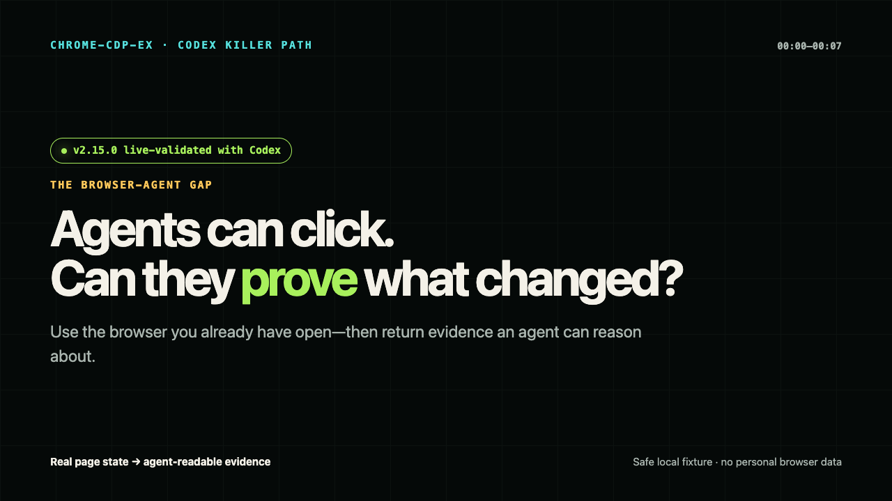

<div align="center">
<h1>chrome-cdp-ex</h1>
<p>
  <a href="skills/chrome-cdp-ex/scripts/cdp.mjs"></a>
  <a href="https://nodejs.org"></a>
  <a href="https://github.com/EndeavorYen/chrome-cdp-ex/releases/tag/v2.20.0"></a>
  <a href="LICENSE"></a>
</p>
<p>
  <a href="experiment/codex-killer-path-demo.mp4"></a>
</p>
<p>
  <strong><a href="experiment/codex-killer-path-demo.mp4">Watch the 60-second Codex demo.</a></strong>
</p>
</div>

## The tab you already have

**Use the browser you already have open.**

Your agent already has Chrome. What it usually gets is a fat page snapshot, or a fresh automated browser that is not the tab with your cookies. chrome-cdp-ex attaches to that live session and does the common jobs in one step, with a short receipt.

Playwright is for clean isolated tests. This is for the session that already has your login.

## Quick start

Needs Node.js 22 (built-in WebSocket). This project does **not** publish to the npm registry.

From a checkout or unpacked release:

```bash
./bin/chrome-cdp doctor
./bin/chrome-cdp list
```

`list` prints target prefixes. Perceive the tab, act once, read the one-line receipt, then `stop` when done.

```bash
./bin/chrome-cdp perceive <target> -C -d 8
./bin/chrome-cdp click <target> @ref
./bin/chrome-cdp fill <target> @ref "you@example.com"
./bin/chrome-cdp press <target> Enter
./bin/chrome-cdp stop
```

`click`, `fill`, and `press` print a one-line receipt with URL, outcome, and next command. A failed action prints `Error:`, a `Kind:` (for example `covered`, `disabled`, `stale-ref`) and a runnable `Next:`, and exits 1.

If `node -v` is older than 22, doctor prints a Node 22 path that `./bin/chrome-cdp` re-execs.

<details>
<summary>Get the files (tarball or git clone)</summary>

Pinned [v2.20.0](https://github.com/EndeavorYen/chrome-cdp-ex/releases/tag/v2.20.0) tarball:

```bash
curl -L -o pi-chrome-cdp-2.20.0.tgz https://github.com/EndeavorYen/chrome-cdp-ex/releases/download/v2.20.0/pi-chrome-cdp-2.20.0.tgz
mkdir -p chrome-cdp-ex-v2.20.0
tar -xzf pi-chrome-cdp-2.20.0.tgz -C chrome-cdp-ex-v2.20.0 --strip-components=1
cd chrome-cdp-ex-v2.20.0
```

Checksum is on the [GitHub Release](https://github.com/EndeavorYen/chrome-cdp-ex/releases/tag/v2.20.0).

Current `main`:

```bash
git clone https://github.com/EndeavorYen/chrome-cdp-ex.git
cd chrome-cdp-ex
```

</details>

[SKILL.md](skills/chrome-cdp-ex/SKILL.md) · [docs/reference.md](docs/reference.md) · [docs/pk-324-board.md](docs/pk-324-board.md) · [INTEGRATIONS.md](INTEGRATIONS.md) · [Grok Bot from-zero](docs/integrations/grok-bot.md)

## What it does

- **See the page cheaply.** `perceive` prints the accessibility tree with `@ref` handles, layout hints and the controls that matter, bounded for tokens. `perceive --since-action` shows only what the last action changed. `text --auto` reads the main content; `shot`, `elshot`, `scanshot` and `responsive-audit` capture pixels, including Electron pages with live WebGL canvases.
- **Act like a person, report like a test.** `click`, `fill`, `press` and `drag` send real CDP input events; `select`, `scroll` and `dismiss-modal` cover the rest. `click` and `fill` on a selector wait briefly for the target to be attached, visible and enabled (`select`: attached and enabled), a click refuses to land on a covering element, and every action returns a receipt: what changed, any dialog it answered, any download it saved (`click --expect-download`), and the next command.
- **Debug the live app.** `console` and `status` print source-mapped stack frames (`src/Foo.tsx:42:7`), `netlog --id N` shows one request's status, timing, headers and a bounded body, and `status --vitals` reports LCP, CLS, INP and long tasks.
- **Drive it from any agent.** It is a Claude Code skill, a plain CLI any agent can shell out to, and a stdio MCP server. MCP results carry screenshots as image blocks, versioned JSON as `structuredContent`, and tool hints derived from the command catalog. See [INTEGRATIONS.md](INTEGRATIONS.md).

## Safe on your real browser

This runs against the browser you are logged into, so the defaults lean careful:

- **Background by default.** Commands do not focus tabs or raise the browser over your work. A screenshot of a truly hidden tab (a background tab, a minimized window) that Chrome will not render fails within about 3 s with `Kind: hidden-tab` and a rerun hint instead of hanging; other commands on a hidden tab can drop input. `CDP_BACKGROUND=0` restores the old activate-the-tab behaviour. See [Background mode](docs/reference.md#background-mode).
- **Redacted by default.** Tokens in URLs (`access_token`, `client_secret`, signed URLs), auth headers, cookie headers, JWTs, values typed into secret-named fields and nested JSON secrets are replaced with `<redacted>` in action receipts, `netlog`, `report`, `record-actions` and session logs. Not covered yet: `console` text, the `cookies` command, and the page URL printed by `perceive`, `status` and `list`. `--unsafe-full` lifts redaction on `netlog`, `checkpoint` and `components`.
- **Secrets stay out of the transcript.** `fill <target> <sel> --secret NAME` types the value of `CDP_SECRET_<NAME>` (or `NAME` from `CDP_SECRETS_FILE`); output shows `<secret:NAME>`.
- **Opt-in guardrails.** `CDP_CONTENT_BOUNDARIES=1` wraps page text in nonce-marked untrusted-content fences, `CDP_ALLOWED_ORIGINS` limits where navigation may go, `CDP_DENY_ACTIONS` refuses chosen commands (and the commands that do the same job), and `CDP_ISOLATED_ONLY=1` refuses to attach to a daily browser profile. They are defense-in-depth for agents, not a security boundary.

## Daily browser CDP

From Chrome 136, `--remote-debugging-port` is ignored on the default profile. chrome-cdp-ex cannot silently attach to an already-running default Chrome or Edge. Use a persistent non-default user-data-dir that you always launch with remote debugging, then sign in once. See [Daily browser CDP](docs/daily-browser-cdp.md) for the launch line (it includes `--disable-backgrounding-occluded-windows`, so a browser window behind your terminal keeps rendering).

Grok Bot from-zero setup (replace computer use / browser use): [docs/integrations/grok-bot.md](docs/integrations/grok-bot.md).

For Electron, launch with a remote debugging port. Set `CDP_PORT` to that port. Use `9333` as the example, not daily Chrome `9222`.

```bash
CDP_PORT=9333 ./bin/chrome-cdp list
```

## Platforms

macOS, Linux, Windows and WSL2 (a Windows-side Node bridges the WSL↔Windows gap). CI runs the full test suite on Linux and Windows for every pull request to `main`.

## License

[MIT](LICENSE)

Built on [pasky/chrome-cdp-skill](https://github.com/pasky/chrome-cdp-skill) by Petr Baudis. Contributors: [ynezz](https://github.com/ynezz), [Jah-yee](https://github.com/Jah-yee), [Rolf Fredheim](https://github.com/rolfredheim), [hussainweb](https://github.com/hussainweb).
